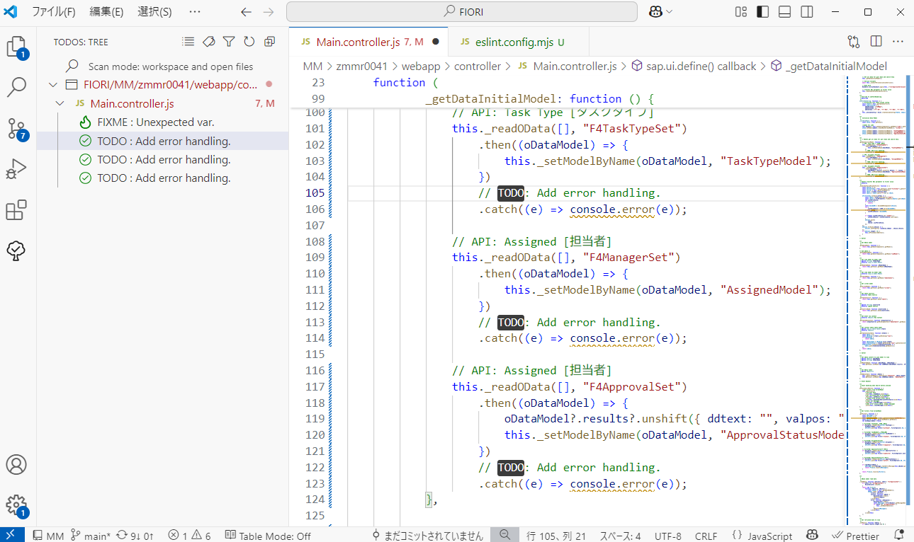
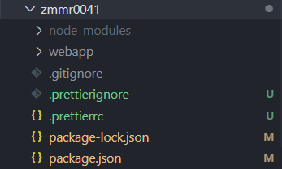
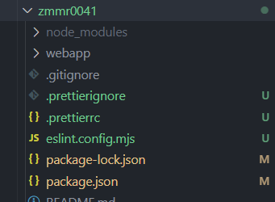
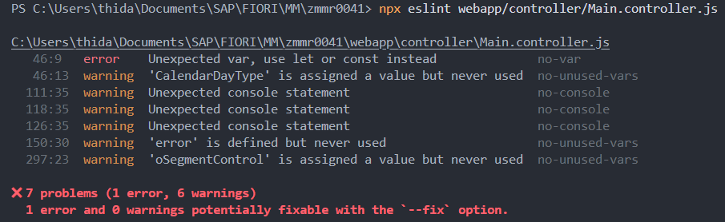

# 背景と目的

このコーディングルールは、SAP Fiori FreeStyle アプリケーションの開発におけるエンジニア間の差異を減らし、品質と効率の両立を目指すことを目的としています。  
これまでチーム開発を進める中で、ソースコードのロジックの可読性やコメントの内容にばらつきがあったり、ロジックが Controller に集中して肥大化してしまうといった問題が発生していました。  
このような問題は、バグやデグレードの発生を助長し、またメンバー間での引き継ぎなどにも悪影響を及ぼします。  
コーディングルールを設けることで、こうした問題の未然防止を図るとともに、個人（特に初心者）のスキル向上や学習の指針にもつながることを期待しています。

一方でコーディングルールを設けることは、柔軟なテクニックや最新機能の使用が制限されることで熟練者の生産性が低下したり、ルールが厳格すぎると、かえって開発効率が落ちるといったデメリットにつながる可能性もあります。  
このような問題を回避するために、本ルールでは、開発における基本的なルールに絞って定義することを心がけています。  
また、必要に応じてルールを見直し、開発において有用と判断できる内容については、柔軟かつ積極的にルールに取り入れてください。

## 目的

1. 可読性・保守性の向上
2. 品質の安定化
3. 一貫性のあるコードベースの構築
4. 開発効率の向上
5. 教育とナレッジ共有の促進

# 基本的なルール

コーディングにおける基本的なルール（コードスタイル）を下記のとおり定義します。

1. [ECMAScript 6](https://github.com/lukehoban/es6features) 以降の構文を積極的に使用すること。
2. インデントはスペース **4** つとする。
3. 1 行あたりの長さの上限は **120** 文字とする。
4. アロー関数を積極的に使用すること。
5. `let` および `const` の使用を**必須**とし、`var` は**使用禁止**とする。
6. Strict Mode（`"use strict";`）を有効にすること。
7. 未宣言の変数は**使用禁止**とする。
8. 非同期処理には Promise や async / await を使用すること。
9. 各ステートメントの末尾にセミコロンを追加すること（省略可能であっても追加する）。
10. `console.***` の使用を**禁止**とする。  
    ※ 開発中の一時的な `console.log` や独自のログ関数の使用は許容する。開発完了時には `console.***` をコメントアウトまたは削除すること。
11. 丸括弧（関数呼び出しやパラメータ）の前後にはスペースを入れないこと。
12. `if` / `else` / `for` / `while` / `do` / `switch` / `try` / `catch` / `finally` の後には、波括弧 `{}` の前後、演算子の前後、カンマの後にスペースを入れること。
13. `==` や `!=` の代わりに、`===` および `!==` を使用すること。

> [!NOTE]
> 基本的なルールとして記載した項目の多くが、後述の Linter および Formatter を導入することで、自動提案や補完が可能です。

# IDE

[Business Application Studio](https://www.sap.com/japan/products/technology-platform/business-application-studio.html) (以下、BAS), [Visual Studio Code](https://code.visualstudio.com/) (以下、VS Code) のいずれかを使用すること。

# ディレクトリ構成

アプリケーション単位のディレクトリ構成を以下のとおり定義します。

```
    module (Repository e.g. "PS")
    └── project (Screen name e.g. "ZPSR0001")
        ├── node_modules
        └── webapp
            ├── controller
            ├── css
            ├── handler
            │   ├── controlHandler
            │   ├── errorHandler
            │   ├── formatter
            │   └── helper
            ├── i18n
            ├── localService
            │   └── mainService
            ├── model
            ├── test
            └── view
```

| ディレクトリ                     | 格納ファイル/ディレクトリ内容                 |
| -------------------------- | ------------------------------- |
| `module/project`           | モジュール内のアプリケーション単位ディレクトリ         |
| `node_modules`             | 外部パッケージ管理（npm）                  |
| `webapp`                   | UI5 アプリケーションのルート                |
| `controller`               | ビューに対応するコントローラファイル              |
| `css`                      | スタイルシート（標準レイアウトに対するカスタム CSS）    |
| `handler/controlHandler`   | コントロールイベント用ロジック（UI イベントの抽象化）    |
| `handler/errorHandler`     | エラーハンドリング専用ロジック                 |
| `handler/formatter`        | データ整形用ロジック（バインディング用）            |
| `handler/helper`           | 補助的なユーティリティ関数群                  |
| `i18n`                     | 多言語化設定ファイルを格納                   |
| `localService/mainService` | OData サービス定義、`metadata.xml` を格納 |
| `model`                    | JSONModel、ODataModel などの定義・初期化  |
| `test`                     | QUnit 等のユニットテストコード              |
| `view`                     | XML View ファイル群                  |

このディレクトリ構成は、以下を目的として定義しています。

-   Controller ファイルの肥大化の防止
-   関心の分離
-   ロジックの再利用性
-   可読性と保守性の維持

これらの目的のために、一般的なディレクトリ構成に「handler」を追加しています。  
共通的なロジックはこの「handler」ディレクトリ配下に、内容ごとにファイルを分割して格納してください。  
一方で、画面特有のイベントロジックや基本的な処理は Controller ファイルに記述します。

「handler」ディレクトリには、目的に応じて以下の 4 つのサブディレクトリを定義しています。  
ディレクトリやファイルを追加する場合は、開発者間で共通認識を持って行うようにしてください。

## controlHandler

Controller から実行されるイベントロジックのうち、各アプリケーションで共通的に用いられる機能や、ロジックとして独立した機能を分割して格納します。  
該当する機能があればファイルを分割してこのディレクトリに格納し、Controller から呼び出してください。

-   bookmark.js
-   excel.js
-   p13nDialog.js
-   valueHelpDialog.js
-   variant.js

> [!NOTE]
> 共通的に使用されない機能や、画面ごとのユニークなイベントロジックは `Main.controller.js` に記述してください。

## errorHandler

主に OData API リクエスト時に使用される共通のエラーハンドリングロジックを格納します。

## formatter

データ整形（バインディング用）のロジックを格納します。

## helper

補助的なユーティリティ関数や、Validation や MessageBox に関する共通ロジックを格納します。

# 命名規則

## 基本原則

命名規則は、SAPUI5 の [JavaScript Coding Guidelines - Naming Conventions](https://help.sap.com/docs/UI_ADD-ON_FOR_SAP_NETWEAVER_20/b4b7cba328bc480d9b373c7da9335537/eded636b85584cd586b1fe231d2b5dac.html#naming-conventions) に準拠するものとします。  
変数およびオブジェクトのフィールド名には、型を示すプレフィックス（接頭辞）を付ける**ハンガリアン記法**を採用します。

> [!NOTE]
> ハンガリアン記法とは、変数名の先頭や末尾に、その変数の型や属性を示すプレフィックスやサフィックス（接尾辞）を付ける命名規則の一種です。

なお API メソッドのパラメータは本命名規則の適用対象外です。以下のプレフィックスを使用し、**キャメルケース**で命名してください。

| プレフィックス | 型            | 例              |
| -------------- | ------------- | --------------- |
| `s`            | String        | **s**Id         |
| `o`            | Object        | **o**DomRef     |
| `$`            | JQuery Object | **$**DomRef     |
| `i` / `n`      | Integer       | **i**Count      |
| `m`            | Map / Hash    | **m**Parameters |
| `a`            | Array         | **a**Entries    |
| `d`            | Date          | **d**Today      |
| `f`            | Float         | **f**Decimal    |
| `b`            | Boolean       | **b**Enabled    |
| `r`            | RegExp        | **r**Pattern    |
| `fn`           | Function      | **fn**Function  |
| `v`            | Variant Types | **v**Variant    |
| `p`            | Promise       | **p**Dialog     |

# クラスの作成

## 基本原則

クラスの作成は、SAPUI5 の [JavaScript Coding Guidelines - Creating Classes](https://help.sap.com/docs/UI_ADD-ON_FOR_SAP_NETWEAVER_20/b4b7cba328bc480d9b373c7da9335537/eded636b85584cd586b1fe231d2b5dac.html#creating-classes) に準拠するものとします。  
以下引用：

-   インスタンスフィールドはコンストラクタ関数内で初期化し、説明を追加する：  
    `this._bReady = false; // リクエストを処理する準備ができている`
-   インスタンスメソッドはコンストラクタ関数のプロトタイプのメンバーとして定義する：  
    `MyClass.prototype.doSomething = function(){...}`
-   静的メンバー（フィールドと関数）はコンストラクタ関数オブジェクト自体のメンバーとして定義する。：  
    `MyClass.doSomething = function(){...}`
-   プライベートメンバーの名前はプレフィックスにアンダースコア(\_)を付けたキャメルケースとする。：  
    `this._bFinalized`
-   コンストラクタ、メソッド、静的メンバーを 1 つの JS ソースファイルにまとめ、クラスの完全修飾名に従って名前と場所を設定する。これはクラスの読み込みの前提条件です。
-   静的クラスにはコンストラクタがなく、オブジェクトリテラルを使用します。このようなクラスの継承パターンはありません。継承が必要な場合は、通常のクラスを使用し、クラス内でシングルトンを作成してください。
-   サブクラスには `SuperClass.extend(…)` を使用しないでください。

# コメントとドキュメンテーション

ソースコード上のコメントルールに関して下記のとおり定義します。

## 基本原則

-   コメントは原則として **英語** で記述すること。  
    ただし、基本設計やテーブル定義等の資料に基づく項目名や処理内容を説明する場合は、設計書の原本の言語（日本語）に準拠して記述（コピー&ペースト）すること。
-   **関数/クラス/API などには JSDoc に準拠したコメントを使用**すること。

```javaScript
	/**
	 * Get view model by model name
	 * @param {String} sModelName
	 * @returns {sap.ui.model.Model}
	 */
	_getModelByName: function (sModelName) {
		return this.getView().getModel(sModelName);
	},
```

-   冗長なコメントは避け、**簡潔かつ的確に** 記述すること。（コードを読めばわかる内容のコメントは不要。）
-   コードの内容そのものではなく **意図・背景・注意点** にフォーカスすること。
-   **なぜ（WHY）そのコードが必要か** を説明すること。  
    「何をしているか（WHAT）」はコードを読めば分かるが、コードから読み取りづらい「なぜそうしているか（WHY）」をコメントで補足する。

```javascript
    // Set the username. <-- BAD
    this.setUserName("John");

    // Sets the name the user gets after logging in. <-- GOOD
    this.setUserName("John");
```

-   プルリクエスト、レビューの前に**コメントアウトした古いコードは削除**すること。  
    ソースコードはバージョン管理されているため、再利用の際は History から復元可能。

## 禁止事項

下記に該当するコメントの記述を禁止します。

-   無意味なコメントや、プログラムと直接関係のないコメント、emoji など。
-   コメントを記述した開発者名。

## アノテーション（タグ）の活用

記述内容によって、以下のようなアノテーションをコメントとして追加することを推奨します。  
アノテーションを記述することで、将来的な修正事項や技術的負債の整理・記録、また修正箇所の見落とし防止につながります。

```javascript
    // TODO: Add error handling.
    // FIXME: Crash if response is null.
    // DEBUG: Verifying recursive logic.
```

| タグ     | 用途例                       |
| -------- | ---------------------------- |
| `TODO:`  | 実装予定、改善ポイント       |
| `FIXME:` | バグ、暫定処理の箇所         |
| `NOTE:`  | 注意喚起、特別な事情         |
| `HACK:`  | 技術的負債、回避策           |
| `DEBUG:` | 開発時のデバッグ用処理の箇所 |

ソースコード上のコメントからアノテーション（タグ）を検索し、リスト化してくれる VS Code 拡張機能 [Todo-Tree](https://marketplace.visualstudio.com/items?itemName=Gruntfuggly.todo-tree) の導入もおすすめです。  
アノテーションを容易に監視・管理することが可能になります。



# ユニットテスト

本ルールにおいては、[QUnit](https://qunitjs.com/) 等の SAPUI5 標準のテストフレームワークを用いたテストコードの作成および処理単位のユニットテストの実施を**不要**とします。  
QUnit 等は、SAPUI5 のような [AMD](https://en.wikipedia.org/wiki/Asynchronous_module_definition) 企画に準拠して設計されたフレームワークのテストにおいては確かに有用です。  
しかしながら、[React](https://react.dev/) や [Vue.js](https://vuejs.org/)、[Angular](https://angular.dev/) 等のモダンなフレームワークでは ES Modules（ESM）が採用されており、現在では AMD 自体が主流ではなくなってきているため、AMD ベースのユニットテストの利用や学習の優先度は低いと判断しました。  
ユーザー操作、データ連携、UIレンダリングと動作等の観点で、手動でのテストを十分に実施するようにしてください。  

一方で、モダンなフレームワークと [UI5 Web Components](https://sap.github.io/ui5-webcomponents/) を用いたアプリケーション開発においては、[Jest](https://jestjs.io/) や [Vitest](https://vitest.dev/) 等のテストフレームワークを積極的に導入してください。

# コードフォーマット

コーディングにおいては、Linter と Formatter の実行を必須とします。  
あらかじめ、画面機能の `package.json` に設定を含め、共通ルールが適用されるようにしてください。  
また、開発環境（Business Application Studio や VS Code）に、後述の拡張機能をインストールすることで、Linter と Formatter を自動化できます。

Linter には [ESLint](https://eslint.org/)、Formatter には [Prettier](https://prettier.io/) を採用します。  
導入および使用方法については、以下に記載します。

## Formatter

Node.js 上で動作するコードフォーマッター [Prettier](https://prettier.io/) を採用します。  
Prettier を使用して、`.js`、`.css`、`.xml` 形式のファイルに対してコードフォーマットを行ってください。

### 導入と使用方法

#### インストール

Prettier をプロジェクトのルートディレクトリにインストールする。

> [!NOTE] 
> `@prettier/plugin-xml` は Prettier のプラグインで、.xml 形式のフォーマットをサポートしています。

```sh
    $ npm install --save-dev prettier @prettier/plugin-xml eslint-config-prettier npm-run-all
```

#### 設定ファイルの追加

プロジェクトのルートディレクトリに、以下のファイルを設置する。



##### `.prettierignore`

Prettier のフォーマット対象から除外したいディレクトリやファイル名を設定する。

ファイル内容:

```ignore:.prettierignore
node_modules
dist
webapp/test
webapp/localService
```

##### `.prettierrc`

Prettier のコードフォーマットのルールを Override する。

ファイル内容:

```json:.prettierrc
{
    "printWidth": 120,
    "tabWidth": 4,
    "useTabs": true,
    "semi": true,
    "singleQuote": false,
    "quoteProps": "as-needed",
    "trailingComma": "es5",
    "bracketSpacing": true,
    "arrowParens": "always",
    "endOfLine": "lf"
}
```

参考: Prettier Option

| オプション       | 型                                            | 説明                                           |
| ---------------- | --------------------------------------------- | ---------------------------------------------- |
| `printWidth`     | `number`                                      | 1 行あたりの最大文字数                         |
| `tabWidth`       | `number`                                      | インデントのスペース数                         |
| `useTabs`        | `boolean`                                     | インデントにタブを使うか                       |
| `semi`           | `boolean`                                     | 文末にセミコロンを付けるか                     |
| `singleQuote`    | `boolean`                                     | 文字列をシングルクォートにするか               |
| `quoteProps`     | `"as-needed"` / `"consistent"` / `"preserve"` | オブジェクトのプロパティにクォートをつける条件 |
| `trailingComma`  | `"none"` / `"es5"` / `"all"`                  | 配列やオブジェクトの末尾にカンマをつけるか     |
| `bracketSpacing` | `boolean`                                     | オブジェクトの {} の内側にスペースを入れるか   |
| `arrowParens`    | `boolean`                                     | アロー関数の引数が 1 つでも括弧を付けるか      |
| `endOfLine`      | `"lf"` / `"crlf"` / `"cr"` / `"auto"`         | 改行コードの指定                               |

#### npm スクリプトの設定

`package.json` に以下の npm Scripts を記述する。

```json:package.json
{
    ...
    "scripts": {
        ...
        "format:def": "prettier --write \"webapp/**/*.{js,jsx,css}\"",
        "format:xml": "prettier --plugin=@prettier/plugin-xml --write \"webapp/**/*.xml\"",
        "format": "run-s format:def format:xml"
    },
    ...
}
```

#### フォーマットの実行

以下のコマンドを実行することでプロジェクト内のすべての対象ファイルに対しフォーマットを実行する。

```bash
    $ npm run format
```

## Linter

[ESLint](https://eslint.org/) は、ソースコードを静的に解析し、コーディングスタイルやパターンに関する問題を特定するためのツールです。  
コーディングスタイルの統一を促進し、品質の向上やバグの早期発見が期待できます。

### 導入と使用方法

#### インストール

ESLint をプロジェクトのルートディレクトリにインストールする。

```sh
    $ npm install --save-dev eslint @eslint/js eslint-config-prettier
```

#### 設定ファイルの追加

プロジェクトのルートディレクトリに、以下のファイルを設置する。



##### `eslint.config.mjs`

eslint のルールと Prettier との競合回避のための設定。

ファイル内容:

```js:eslint.config.mjs
import js from "@eslint/js";
import prettier from "eslint-config-prettier";

export default [
	// Apply ESLint’s standard recommended configuration
	js.configs.recommended,

	{
		files: ["webapp/**/*.js"],
		languageOptions: {
			ecmaVersion: 2021,
			sourceType: "script", // UI5's AMD format (not ESM)
			globals: {
				sap: "readonly",
				jQuery: "readonly",
				$: "readonly",
				window: "readonly",
				document: "readonly",
			},
		},
		rules: {
			// Relax or explicitly define specific rules for SAP UI5
			"no-undef": "off",
			"no-console": "warn",
			"no-unused-vars": ["warn", { vars: "all", args: "after-used" }],
			"no-template-curly-in-string": "warn",
			eqeqeq: ["error", "always"],
			"no-extra-semi": ["error", "always"],
			"no-nested-ternary": "error",
			"no-var": "error",
			"max-depth": ["error", { max: 8 }],
			"prefer-const": "error",
		},
	},
	// Integrate Prettier formatting rules into ESLint to avoid conflicts
	{
		files: ["webapp/**/*.js"],
		name: "prettier-config",
		...prettier,
	},
];
```

#### ESLint の実行

以下のコマンドで ソースコードを 静的解析を実行する。

単一のファイルに対し解析する場合

```sh
    $ npx eslint webapp/controller/Main.controller.js
```

解析結果イメージ:  


webapp 下のすべての.js ファイルに対し解析する場合

```sh
    $ npx eslint webapp/**
```

> [!NOTE]
> 上記のコマンドに `--fix` オプションを追加すると、error 箇所をまとめて修正することが出来ます。※ 機械的な修正

## VS Code Extension の使用

VS Code Extension のインストールと設定を行うことで、Linter と Formatter を自動化することが可能。

-   [Prettier-vscode](https://marketplace.visualstudio.com/items?itemName=esbenp.prettier-vscode)  
    Extension を BAS または VS Code にインストールすることで、任意のファイルのフォーマットの実行が可能。  
    使用方法は Extension の Usage を参照すること。

-   [vscode-ESLint](https://marketplace.visualstudio.com/items?itemName=dbaeumer.vscode-eslint)  
    Extension を BAS または VS Code にインストールすることで、ESLint に関する各種設定をすることが可能。  
    使用方法は Extension の Usage を参照すること。

### Linter, Formatter の自動化

上述の Extensions をインストールし、VS Code の `settings.json` に以下の設定を追加することで、コーディング中にリアルタイムで ESLint による解析が行われ、ファイル保存時（Ctrl+S）には Formatter が自動実行されるようになります。

```json:settings.json
{
    "editor.defaultFormatter": "esbenp.prettier-vscode",
    "editor.formatOnSave": true,
    "eslint.validate": ["javascript"],
    "eslint.run": "onType",
    "eslint.workingDirectories": [{ "mode": "auto" }]
}
```

参考: 設定内容

| 設定                        | 目的                                                                          |
| --------------------------- | ----------------------------------------------------------------------------- |
| `editor.defaultFormatter`   | VS Code の「デフォルトフォーマッター」として Prettier を使用する。            |
| `editor.formatOnSave`       | ファイル保存時に自動的にコードを整形する。                                    |
| `eslint.validate`           | VS Code で ESLint を JavaScript ファイルに対して有効化する。                  |
| `eslint.run`                | 入力中に ESLint を実行する（ `"onType"`: リアルタイムで警告やエラーが出る）。 |
| `eslint.workingDirectories` | ESLint にプロジェクトルート（eslint.config.js 等の場所）を自動検出させる。    |

> [!WARNING]
> 以下の設定を VS Code 全体の `settings.json` に追加すると、意図しないプロジェクトに対して Linter や Formatter が実行される可能性があります。  
> 特に `editor.formatOnSave` は、他プロジェクトへの影響に十分注意した上で有効化してください。

# （補足）開発におけるマインドセットと実践

補足情報として、プログラミングにおいて重視すべき心構えと、実践すべきことを以下に列挙します。

**「読みやすさ」は保守性と拡張性の鍵**  
  
コードの可読性と保守性を常に意識しましょう。  
自分以外の開発者が理解しやすいコードを目指してください。  
例えば、1 年後に自分自身が今のコードを見たとき、求めることは「スマートさ」よりも「明確さ」です。

コードの再利用性を考慮し、DRY 原則（Don't Repeat Yourself.）を守りつつ、KISS 原則（Keep It Simple, Stupid.）を意識しましょう。

> [!NOTE]
> DRY 原則に基づきロジックを過度に共通化すると、可読性やメンテナンス性が低下し、1 箇所の修正が広範囲に影響を及ぼす恐れがあります。  
> 「本当に共通化すべきかどうか」や「意味のある重複かどうか」を適切に判断して実施するべきです。

**学ぶ姿勢**  
  
常に「今のベストプラクティスは何か？」を疑ってください。  
ESLint や Formatter、TypeScript、各種フレームワークは、いわば補助輪のようなものです。  
これらのツールが開発者たちの助けとなるために生まれたことに敬意を払いながら、「なぜこうなるのか」を理解しようとする姿勢が、確実な成長につながります

**関心の分離**  
  
関数やクラスは、単一の責任を持たせるよう意識しましょう。  
役割や責任（関心）を分離することで、再利用やテストを行いやすくなるとともに、ソースコードを理解しやすくなります。

**デグレード防止のために**  
  
デグレードが発生する主な原因として、ソースコードの理解不足、影響範囲の考慮漏れなどが考えられます。  
これらを防止するために、まずはコードの **「目的」** を理解してから開発を行いましょう。  
また、変更による影響範囲を必ず確認し、常に意識することが重要です。

最後に、プルリクエストやレビューの前には、自分が行った変更点（ソースコードの差分）が適切であることを必ず確認しましょう。

---

版: 0.1  
作成日: 2025/06/09  
作成者: Hida Toshiaki
