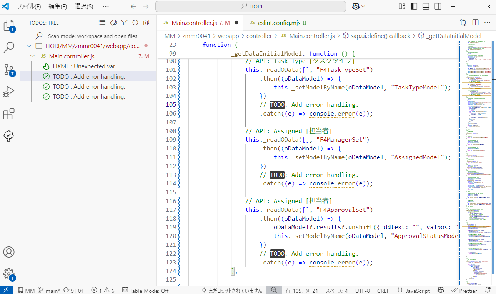

# Background and Purpose

This coding guideline aims to reduce discrepancies among engineers in SAP Fiori FreeStyle application development, striving to balance both quality and efficiency.  
During past team developments, issues have arisen such as inconsistent code readability, uneven comment quality, and overly bloated Controllers due to logic being concentrated there.  
These problems tend to cause bugs, regressions, and hinder smooth handovers between team members.  
By establishing coding rules, we aim to prevent such issues in advance, while also providing guidance for individual skill improvement—especially for beginners—and a framework for learning.

On the other hand, setting coding rules may limit experienced developers' productivity by restricting flexible techniques or the use of the latest features. If rules are too strict, they can even reduce development efficiency.  
To avoid these drawbacks, this guideline focuses on defining only the fundamental rules necessary for development.  
We also encourage revisiting and updating the rules as needed—actively and flexibly incorporating practices that prove useful in the development process.

## Objectives

1. Improve readability and maintainability
2. Stabilize code quality
3. Build a consistent codebase
4. Enhance development efficiency
5. Promote learning and knowledge sharing

# Basic Rules

The following are the basic coding style rules to be applied during development:

1. Actively use syntax introduced in [ECMAScript 6](https://github.com/lukehoban/es6features) and later.
2. Use **4 spaces** for indentation.
3. Limit each line to a maximum of **120** characters.
4. Make active use of arrow functions.
5. Use `let` and `const` **mandatorily**; usage of `var` is **prohibited**.
6. Enable Strict Mode (`"use strict";`).
7. The use of undeclared variables is **prohibited**.
8. Use Promises or async/await for asynchronous processing.
9. Always add semicolons at the end of each statement, even if optional.
10. The use of `console.***` is **prohibited**.  
    ※ Temporary use of `console.log` or custom logging functions during development is allowed. However, all `console.***` should be commented out or removed upon completion.
11. Do **not** insert spaces before or after parentheses (in function calls or parameters).
12. Insert spaces **before and after** curly braces `{}` following `if` / `else` / `for` / `while` / `do` / `switch` / `try` / `catch` / `finally`, as well as around operators and after commas.
13. Use `===` and `!==` instead of `==` and `!=`.

> [!NOTE]  
> Many of the above rules can be automatically suggested or enforced by introducing a linter and formatter, as described later.

# IDE

Use either [Business Application Studio](https://www.sap.com/japan/products/technology-platform/business-application-studio.html) (hereafter BAS) or [Visual Studio Code](https://code.visualstudio.com/) (hereafter VS Code).

# Directory Structure

The directory structure for each application unit is defined as follows:

```
    module (Repository e.g. "PS")
    └── project (Screen name e.g. "ZPSR0001")
        ├── node_modules
        └── webapp
            ├── controller
            ├── css
            ├── handler
            │   ├── controlHandler
            │   ├── errorHandler
            │   ├── formatter
            │   └── helper
            ├── i18n
            ├── localService
            │   └── mainService
            ├── model
            ├── test
            └── view
```

| Directory                  | Contents / Stored Files                                      |
| -------------------------- | ------------------------------------------------------------ |
| `module/project`           | Application unit directory inside the module                 |
| `node_modules`             | External package management (npm)                            |
| `webapp`                   | Root of the UI5 application                                  |
| `controller`               | Controller files corresponding to views                      |
| `css`                      | Stylesheets (custom CSS for standard layout)                 |
| `handler/controlHandler`   | Logic for control events (abstraction of UI events)          |
| `handler/errorHandler`     | Dedicated error handling logic                               |
| `handler/formatter`        | Logic for data formatting (for bindings)                     |
| `handler/helper`           | Auxiliary utility functions                                  |
| `i18n`                     | Files for multilingual settings                              |
| `localService/mainService` | OData service definitions, including `metadata.xml`          |
| `model`                    | Definition and initialization of JSONModel, ODataModel, etc. |
| `test`                     | Unit test code such as QUnit                                 |
| `view`                     | XML View files                                               |

This directory structure is defined with the following objectives:

- Prevent bloating of Controller files
- Separation of concerns
- Reusability of logic
- Maintain readability and maintainability

To achieve these goals, a "handler" directory has been added to the general directory structure.  
Common logic should be placed under this "handler" directory, divided into separate files by content type.  
Meanwhile, screen-specific event logic and fundamental processing should be written within Controller files.

The "handler" directory includes the following four subdirectories according to purpose.  
When adding directories or files, please ensure common understanding among developers.

## controlHandler

This directory contains event logic executed from Controllers that are commonly used across applications or logically independent features.  
If applicable, split such functionalities into separate files under this directory and call them from the Controller.

- bookmark.js
- excel.js
- p13nDialog.js
- valueHelpDialog.js
- variant.js

> [!NOTE]  
> Features that are not commonly used or unique event logic specific to each screen should be written in `Main.controller.js`.

## errorHandler

Stores common error handling logic mainly used during OData API requests.

## formatter

Contains logic for data formatting (for binding purposes).

## helper

Stores auxiliary utility functions and common logic related to Validation and MessageBox.

# Naming Conventions

## Basic Principles

Naming conventions shall comply with SAPUI5's [JavaScript Coding Guidelines - Naming Conventions](https://help.sap.com/docs/UI_ADD-ON_FOR_SAP_NETWEAVER_20/b4b7cba328bc480d9b373c7da9335537/eded636b85584cd586b1fe231d2b5dac.html#naming-conventions).  
For variable and object field names, **Hungarian notation** is adopted, which adds a prefix indicating the data type.

> [!NOTE]  
> Hungarian notation is a naming convention that attaches prefixes or suffixes indicating the variable’s type or attribute to the beginning or end of the variable name.

API method parameters are excluded from this naming convention. Instead, use the prefixes below and name them in **camelCase**.

| Prefix    | Type          | Example         |
| --------- | ------------- | --------------- |
| `s`       | String        | **s**Id         |
| `o`       | Object        | **o**DomRef     |
| `$`       | JQuery Object | $DomRef         |
| `i` / `n` | Integer       | **i**Count      |
| `m`       | Map / Hash    | **m**Parameters |
| `a`       | Array         | **a**Entries    |
| `d`       | Date          | **d**Today      |
| `f`       | Float         | **f**Decimal    |
| `b`       | Boolean       | **b**Enabled    |
| `r`       | RegExp        | **r**Pattern    |
| `fn`      | Function      | **fn**Function  |
| `v`       | Variant Types | **v**Variant    |
| `p`       | Promise       | **p**Dialog     |

## Constants

Define constants using **uppercase snake case** (`CONSTANT_NAME`).  
For example, strings such as model names that are frequently used in the controller should not be hardcoded in each process.  
Instead, define them at the beginning of the second argument (function) in `sap.ui.define`.

```javascript
    "use strict";

    const PROGRAM_ID = "xxxxxxxx";
    const MAIN_TABLE_MODEL_NAME = "oDataTable";

    return Controller.extend("xxxxxxxx.controller.Main", {
```

# Class Creation

## Basic Principles

Class creation shall comply with SAPUI5's [JavaScript Coding Guidelines - Creating Classes](https://help.sap.com/docs/UI_ADD-ON_FOR_SAP_NETWEAVER_20/b4b7cba328bc480d9b373c7da9335537/eded636b85584cd586b1fe231d2b5dac.html#creating-classes).  
Summary:

- Initialize instance fields inside the constructor function with explanatory comments:  
  `this._bReady = false; // Ready to process requests`
- Define instance methods as members of the constructor function’s prototype:  
  `MyClass.prototype.doSomething = function(){...}`
- Define static members (fields and functions) as members of the constructor function object itself:  
  `MyClass.doSomething = function(){...}`
- Private member names use camelCase prefixed with an underscore (_):  
  `this._bFinalized`
- Combine constructor, methods, and static members into a single JS source file named and located according to the class’s fully qualified name. This is a prerequisite for class loading.
- Static classes have no constructor and use object literals. These classes cannot be extended. If inheritance is needed, use a normal class and create a singleton inside it.
- Do not use `SuperClass.extend(…)` for subclasses.

## Getter and Setter

Functions frequently used in SAPUI5 programming should be explicitly declared and used as **getters** and **setters**.  
Prefix the function names with `get` / `set`, and if they refer to the same target, keep the naming consistent thereafter.  
Also, organize all getter and setter definitions together in a single place.

```javascript
    // Getter

    /**
     * Get view model by model name
     * @param {String} sModelName
     * @returns {sap.ui.model.Model}
     */
    _getModelByName: function (sModelName) {
        return this.getView().getModel(sModelName);
    },

    /**
     * Get main table view model
     * @returns {sap.ui.model.Model}
     */
    _getTableModel: function () {
        return this.getView().getModel(MAIN_TABLE_MODEL_NAME);
    },

    /**
     * Get context odata table model
     * @param {sap.ui.table.Table} oTable
     * @returns {Object}
     */
    _getTableContextData: function (oTable) {
        const aData = [];
        const oBinding = oTable.getBinding("rows");
        if (!oBinding) return aData;

        const aDataLength = oBinding.oList.length;
        const aTableContext = oTable.getBinding("rows").getContexts(0, aDataLength);
        aTableContext.forEach((oTableContextItem) => {
            aData.push(oTableContextItem.getObject());
        });
        return aData;
    },

    // Setter

    /**
     * Set odata convert to json model with the specified model name to view
     * @param {Object} oDataModel
     * @param {String} sModelName
     */
    _setModelByName: function (oDataModel, sModelName) {
        this.getView().setModel(new JSONModel(oDataModel.results), sModelName);
    },

    /**
     * Set odata convert to json model to main table view
     * @param {Object[]}
     */
    _setTableModel: function (oData) {
        this._getScreenModel().setProperty("/RowCount", oData.length);
        this.getView().setModel(new JSONModel(oData), MAIN_TABLE_MODEL_NAME);
    },
```

# Comments and Documentation

The rules for comments in source code are defined as follows.

## Basic Principles

- Comments should be written in **English** as a general rule.  
  However, when explaining item names or processing details based on materials such as basic design documents or table definitions, write (copy & paste) in the language of the original document (Japanese).
- Use comments compliant with **JSDoc** for functions, classes, APIs, etc.

```javaScript
	/**
	 * Get view model by model name
	 * @param {String} sModelName
	 * @returns {sap.ui.model.Model}
	 */
	_getModelByName: function (sModelName) {
		return this.getView().getModel(sModelName);
	},
```

- Avoid verbose comments; write **concise and precise** comments. (Comments explaining what is obvious from reading the code are unnecessary.)
- Focus on **intent, background, and points of caution**, not on the code content itself.
- Explain **why (WHY)** the code is necessary.  
  While "what" the code does (WHAT) is clear from reading it, use comments to clarify the "why" that is not easily understood from the code itself.

```javascript
    // Set the username. <-- BAD
    this.setUserName("John");

    // Sets the name the user gets after logging in. <-- GOOD
    this.setUserName("John");
```

- Delete any commented-out old code before pull requests and reviews.  
  Since source code is managed by version control, you can restore previous code from history if needed.

## Prohibited Items

The following types of comments are prohibited:

- Meaningless comments, comments unrelated directly to the program, and emojis.
- Developer names in comments.

## Use of Annotations (Tags)

It is recommended to add annotations as comments depending on the content.  
Using annotations helps with future fixes, organizing and recording technical debt, and preventing overlooked changes.

```javascript
    // TODO: Add error handling.
    // FIXME: Crash if response is null.
    // DEBUG: Verifying recursive logic.
```

| Tag      | Typical Usage                         |
| -------- | ------------------------------------- |
| `TODO:`  | Planned implementations, improvements |
| `FIXME:` | Bugs, temporary fixes                 |
| `NOTE:`  | Warnings, special considerations      |
| `HACK:`  | Technical debt, workarounds           |
| `DEBUG:` | Debug-related code during development |

We also recommend installing the VS Code extension [Todo-Tree](https://marketplace.visualstudio.com/items?itemName=Gruntfuggly.todo-tree),  
which searches for annotations (tags) in source code comments and lists them.  
This makes it easier to monitor and manage annotations.



# Unit Testing

Under this rule, creating test code and performing unit tests at the processing level using SAPUI5 standard test frameworks such as [QUnit](https://qunitjs.com/) is considered **unnecessary**.  
Frameworks like QUnit are certainly useful for testing systems designed based on the [AMD](https://en.wikipedia.org/wiki/Asynchronous_module_definition) specification, such as SAPUI5.  
However, modern frameworks like [React](https://react.dev/), [Vue.js](https://vuejs.org/), and [Angular](https://angular.dev/) adopt ES Modules (ESM), and since AMD is no longer mainstream, we have determined that the priority for using and learning AMD-based unit testing is low.  
Please be sure to conduct thorough manual testing, focusing on user interactions, data integration, UI rendering, and behavior.

On the other hand, when developing applications with modern frameworks and [UI5 Web Components](https://sap.github.io/ui5-webcomponents/), actively adopt test frameworks such as [Jest](https://jestjs.io/) and [Vitest](https://vitest.dev/).

# Code Formatting


Running both a linter and a formatter is mandatory when coding.  
Be sure to include the necessary settings in the `package.json` file of the screen module in advance so that a common rule set can be applied.  
By installing the extensions described below in your development environment (such as Business Application Studio or VS Code), you can automate linting and formatting.

We use [ESLint](https://eslint.org/) as the linter and [Prettier](https://prettier.io/) as the formatter.  
Instructions for installation and usage are provided below.

## Formatter

We adopt the code formatter [Prettier](https://prettier.io/) running on Node.js.  
Use Prettier to format files with `.js`, `.css`, and `.xml` extensions.

### Installation and Usage

#### Installation

Install Prettier in the root directory of the project.

> [!NOTE]
> `@prettier/plugin-xml` is a Prettier plugin that supports formatting `.xml` files.

```sh
    $ npm install --save-dev prettier @prettier/plugin-xml eslint-config-prettier npm-run-all
```

#### Adding Configuration Files

Place the following files in the root directory of the project.


##### `.prettierignore`

Specify directories and file names to exclude from Prettier formatting.

File content:

```ignore:.prettierignore
node_modules
dist
webapp/test
webapp/localService
```

##### `.prettierrc`

Override the code formatting rules of Prettier.

File content:

```json:.prettierrc
{
    "printWidth": 120,
    "tabWidth": 4,
    "useTabs": true,
    "semi": true,
    "singleQuote": false,
    "quoteProps": "as-needed",
    "trailingComma": "es5",
    "bracketSpacing": true,
    "arrowParens": "always",
    "endOfLine": "lf"
}
```

Reference: Prettier Options

| Option           | Type                                          | Description                                                            |
| ---------------- | --------------------------------------------- | ---------------------------------------------------------------------- |
| `printWidth`     | `number`                                      | Maximum characters per line                                            |
| `tabWidth`       | `number`                                      | Number of spaces per indentation level                                 |
| `useTabs`        | `boolean`                                     | Whether to use tabs for indentation                                    |
| `semi`           | `boolean`                                     | Whether to add semicolons at the end of statements                     |
| `singleQuote`    | `boolean`                                     | Whether to use single quotes for strings                               |
| `quoteProps`     | `"as-needed"` / `"consistent"` / `"preserve"` | When to quote object properties                                        |
| `trailingComma`  | `"none"` / `"es5"` / `"all"`                  | Whether to add trailing commas in arrays or objects                    |
| `bracketSpacing` | `boolean`                                     | Whether to add spaces inside object braces `{}`                        |
| `arrowParens`    | `boolean`                                     | Whether to include parentheses around single arrow function parameters |
| `endOfLine`      | `"lf"` / `"crlf"` / `"cr"` / `"auto"`         | Specifies the line ending character                                    |

#### npm Script Setup

Add the following npm scripts to `package.json`.

```json:package.json
{
    ...
    "scripts": {
        ...
        "format:def": "prettier --write \"webapp/**/*.{js,jsx,css}\"",
        "format:xml": "prettier --plugin=@prettier/plugin-xml --write \"webapp/**/*.xml\"",
        "format": "run-s format:def format:xml"
    },
    ...
}
```

#### Running the Formatter

By running the following command, the formatter will be applied to all target files within the project.

```bash
    $ npm run format
```

## Linter

[ESLint](https://eslint.org/) is a tool that performs static analysis on source code to identify issues related to coding styles and patterns.  
It helps enforce consistent coding practices, leading to improved code quality and early detection of bugs.

### Introduction and Usage

#### Installation

Install ESLint in the root directory of your project.

```sh
    $ npm install --save-dev eslint @eslint/js eslint-config-prettier
```

#### Adding Configuration Files

Place the following files in the root directory of the project.


##### `eslint.config.mjs`

Settings for ESLint rules and to avoid conflicts with Prettier.

File contents:

```js:eslint.config.mjs
import js from "@eslint/js";
import prettier from "eslint-config-prettier";

export default [
	// Apply ESLint’s standard recommended configuration
	js.configs.recommended,

	{
		files: ["webapp/**/*.js"],
		languageOptions: {
			ecmaVersion: 2021,
			sourceType: "script", // UI5's AMD format (not ESM)
			globals: {
				sap: "readonly",
				jQuery: "readonly",
				$: "readonly",
				window: "readonly",
				document: "readonly",
			},
		},
		rules: {
			// Relax or explicitly define specific rules for SAP UI5
			"no-undef": "off",
			"no-console": "warn",
			"no-unused-vars": ["warn", { vars: "all", args: "after-used" }],
			"no-template-curly-in-string": "warn",
			eqeqeq: ["error", "always"],
			"no-extra-semi": ["error", "always"],
			"no-nested-ternary": "error",
			"no-var": "error",
			"max-depth": ["error", { max: 8 }],
			"prefer-const": "error",
		},
	},
	// Integrate Prettier formatting rules into ESLint to avoid conflicts
	{
		files: ["webapp/**/*.js"],
		name: "prettier-config",
		...prettier,
	},
];
```

#### Running ESLint

Use the following command to perform static analysis on the source code.

To analyze a single file:

```sh
    $ npx eslint webapp/controller/Main.controller.js
```

Analysis result example:  


To analyze all `.js` files under the `webapp` directory:

```sh
    $ npx eslint webapp/**
```

> [!NOTE]  
> Adding the `--fix` option to the above command will automatically fix the error points.  
> *Note: These are mechanical fixes.*

## Using VS Code Extensions

By installing and configuring VS Code Extensions, you can automate the Linter and Formatter.

- [Prettier-vscode](https://marketplace.visualstudio.com/items?itemName=esbenp.prettier-vscode)  
  Installing this extension in BAS or VS Code allows you to format files as needed.  
  Refer to the extension's Usage section for instructions.

- [vscode-ESLint](https://marketplace.visualstudio.com/items?itemName=dbaeumer.vscode-eslint)  
  Installing this extension in BAS or VS Code enables various ESLint-related settings.  
  Refer to the extension's Usage section for instructions.

### Automating Linter and Formatter

By installing the above extensions and adding the following settings to VS Code's `settings.json`, ESLint will analyze your code in real time while coding, and the formatter will automatically run when you save the file (Ctrl+S).

```json:settings.json
{
    "editor.defaultFormatter": "esbenp.prettier-vscode",
    "editor.formatOnSave": true,
    "eslint.validate": ["javascript"],
    "eslint.run": "onType",
    "eslint.workingDirectories": [{ "mode": "auto" }]
}
```

Reference: Settings

| Setting                     | Purpose                                                                               |
| --------------------------- | ------------------------------------------------------------------------------------- |
| `editor.defaultFormatter`   | Use Prettier as the default formatter in VS Code.                                     |
| `editor.formatOnSave`       | Automatically format code upon file save.                                             |
| `eslint.validate`           | Enable ESLint for JavaScript files in VS Code.                                        |
| `eslint.run`                | Run ESLint while typing (`"onType"`: show warnings and errors in real time).          |
| `eslint.workingDirectories` | Automatically detect the project root for ESLint (where eslint.config.js is located). |

> [!WARNING]  
> Adding the following settings to the global VS Code `settings.json` may cause Linter and Formatter to run on unintended projects.  
> Especially be careful with enabling `editor.formatOnSave` as it may affect other projects.

# (Supplement) Mindset and Practices in Development

As supplementary information, here are some key mindsets and practices to emphasize in programming.

**"Readability" is the key to maintainability and extensibility**  

Always keep code readability and maintainability in mind.  
Aim to write code that other developers can easily understand.  
For example, when you look at your own code one year later, what you want is clarity rather than cleverness.

Consider code reusability by following the DRY principle (Don't Repeat Yourself) while keeping the KISS principle (Keep It Simple, Stupid) in mind.

> [!NOTE]  
> Over-sharing logic based on the DRY principle can reduce readability and maintainability, and a fix in one place may have widespread effects.  
> You should carefully judge whether something truly needs to be shared or if meaningful duplication is acceptable.

**A Learning Attitude**  

Always question "What is the best practice now?"  
Tools like ESLint, Formatter, TypeScript, and various frameworks are like training wheels.  
Respect the fact that these tools were created to support developers, and adopting an attitude of trying to understand "why it works this way" leads to steady growth.

**Separation of Concerns**  

Be mindful to give functions and classes a single responsibility.  
By separating roles and responsibilities (concerns), it becomes easier to reuse and test code, and the source code becomes easier to understand.

**To Prevent Regression**  

Common causes of regression include insufficient understanding of the source code and overlooking the scope of impact.  
To prevent these, first understand the **"purpose"** of the code before development.  
Also, always verify and keep in mind the impact scope of any changes.

Finally, before submitting pull requests or reviews, always confirm that the changes you made (code diffs) are appropriate.
