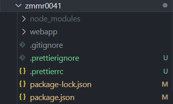
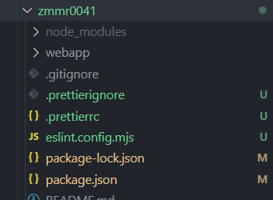

# Bối cảnh và Mục đích

Quy tắc viết mã này nhằm giảm sự khác biệt giữa các kỹ sư trong quá trình phát triển ứng dụng SAP Fiori FreeStyle, đồng thời hướng đến sự cân bằng giữa chất lượng và hiệu suất.  
Trong quá trình phát triển nhóm trước đây, đã phát sinh các vấn đề như độ dễ đọc không đồng đều trong mã nguồn, nội dung chú thích thiếu nhất quán, và logic bị dồn vào Controller khiến nó trở nên quá cồng kềnh.  
Những vấn đề này có thể dẫn đến lỗi, thoái hóa chức năng, và gây khó khăn trong việc bàn giao giữa các thành viên.  
Bằng cách thiết lập quy tắc viết mã, chúng tôi kỳ vọng sẽ ngăn ngừa trước những vấn đề này, đồng thời giúp cải thiện kỹ năng cá nhân—đặc biệt là với người mới bắt đầu—và cung cấp định hướng học tập rõ ràng.

Tuy nhiên, việc thiết lập quy tắc cũng có thể mang lại những bất lợi, chẳng hạn như làm giảm năng suất của các lập trình viên giàu kinh nghiệm khi bị hạn chế trong việc sử dụng kỹ thuật linh hoạt hoặc tính năng mới. Nếu quy tắc quá nghiêm ngặt, hiệu suất phát triển cũng có thể bị ảnh hưởng.  
Để tránh những vấn đề này, bộ quy tắc này chỉ tập trung vào các quy tắc cơ bản cần thiết trong quá trình phát triển.  
Ngoài ra, hãy thường xuyên xem xét và cập nhật quy tắc khi cần thiết, và chủ động tích hợp các nội dung hữu ích vào thực tiễn phát triển.

## Mục tiêu

1. Cải thiện khả năng đọc và bảo trì
2. Ổn định chất lượng mã
3. Xây dựng một cơ sở mã nhất quán
4. Nâng cao hiệu suất phát triển
5. Thúc đẩy đào tạo và chia sẻ kiến thức

# Quy tắc cơ bản

Dưới đây là các quy tắc cơ bản về phong cách viết mã cần được tuân thủ trong quá trình phát triển:

1. Tích cực sử dụng cú pháp từ [ECMAScript 6](https://github.com/lukehoban/es6features) trở đi.
2. Sử dụng **4 dấu cách** để thụt đầu dòng.
3. Giới hạn độ dài mỗi dòng ở mức tối đa **120** ký tự.
4. Ưu tiên sử dụng arrow function.
5. Bắt buộc sử dụng `let` và `const`; **không được phép** dùng `var`.
6. Bật chế độ Strict (`"use strict";`).
7. **Cấm sử dụng** biến chưa được khai báo.
8. Sử dụng Promise hoặc async/await để xử lý bất đồng bộ.
9. Luôn thêm dấu chấm phẩy ở cuối mỗi câu lệnh, kể cả khi có thể bỏ qua.
10. **Không được sử dụng** `console.***`.  
    ※ Có thể tạm thời sử dụng `console.log` hoặc hàm log tùy chỉnh trong quá trình phát triển, nhưng cần **xóa hoặc ghi chú lại** toàn bộ `console.***` khi hoàn thành.
11. **Không thêm khoảng trắng** trước hoặc sau dấu ngoặc tròn (khi gọi hàm hoặc khai báo tham số).
12. Thêm khoảng trắng **trước và sau** dấu ngoặc nhọn `{}` sau các câu lệnh như `if` / `else` / `for` / `while` / `do` / `switch` / `try` / `catch` / `finally`, cũng như **xung quanh toán tử** và **sau dấu phẩy**.
13. Sử dụng `===` và `!==` thay vì `==` và `!=`.

> [!NOTE]  
> Phần lớn các quy tắc cơ bản này có thể được gợi ý hoặc tự động áp dụng bằng cách sử dụng các công cụ linter và formatter sẽ được đề cập sau.

# IDE

Sử dụng một trong hai công cụ: [Business Application Studio](https://www.sap.com/japan/products/technology-platform/business-application-studio.html) (gọi tắt là BAS) hoặc [Visual Studio Code](https://code.visualstudio.com/) (gọi tắt là VS Code).

# Cấu trúc thư mục

Cấu trúc thư mục cho từng đơn vị ứng dụng được định nghĩa như sau:

```
    module (Repository e.g. "PS")
    └── project (Screen name e.g. "ZPSR0001")
        ├── node_modules
        └── webapp
            ├── controller
            ├── css
            ├── handler
            │   ├── controlHandler
            │   ├── errorHandler
            │   ├── formatter
            │   └── helper
            ├── i18n
            ├── localService
            │   └── mainService
            ├── model
            ├── test
            └── view
```

| Thư mục                    | Nội dung / Tập tin lưu trữ                                 |
| -------------------------- | ---------------------------------------------------------- |
| `module/project`           | Thư mục đơn vị ứng dụng bên trong module                   |
| `node_modules`             | Quản lý gói bên ngoài (npm)                                |
| `webapp`                   | Thư mục gốc của ứng dụng UI5                               |
| `controller`               | Tập tin controller tương ứng với view                      |
| `css`                      | Tập tin stylesheet (CSS tùy chỉnh cho layout chuẩn)        |
| `handler/controlHandler`   | Logic xử lý sự kiện điều khiển (trừu tượng hóa sự kiện UI) |
| `handler/errorHandler`     | Logic chuyên biệt xử lý lỗi                                |
| `handler/formatter`        | Logic định dạng dữ liệu (dùng cho binding)                 |
| `handler/helper`           | Các hàm tiện ích hỗ trợ                                    |
| `i18n`                     | Tập tin cấu hình đa ngôn ngữ                               |
| `localService/mainService` | Định nghĩa dịch vụ OData, bao gồm `metadata.xml`           |
| `model`                    | Định nghĩa và khởi tạo JSONModel, ODataModel, v.v.         |
| `test`                     | Mã kiểm thử đơn vị như QUnit                               |
| `view`                     | Tập tin XML View                                           |

Cấu trúc thư mục này được định nghĩa với các mục tiêu sau:

- Ngăn chặn việc controller trở nên quá cồng kềnh
- Tách biệt các mối quan tâm
- Tăng khả năng tái sử dụng logic
- Duy trì khả năng đọc và bảo trì

Để đạt được các mục tiêu này, thư mục "handler" được thêm vào cấu trúc thư mục chung.  
Logic dùng chung nên được đặt trong thư mục "handler" này, phân chia thành các tập tin riêng theo từng loại nội dung.  
Trong khi đó, logic sự kiện đặc thù màn hình và xử lý cơ bản nên viết trong các tập tin Controller.

Thư mục "handler" bao gồm bốn thư mục con theo mục đích sử dụng dưới đây.  
Khi thêm thư mục hoặc tập tin mới, vui lòng đảm bảo sự đồng thuận chung giữa các nhà phát triển.

## controlHandler

Thư mục này chứa các logic sự kiện được thực thi từ Controller, bao gồm các chức năng chung được sử dụng trong nhiều ứng dụng hoặc các tính năng độc lập về mặt logic.  
Nếu có các chức năng phù hợp, hãy chia thành các tập tin riêng và đặt trong thư mục này, sau đó gọi từ Controller.

- bookmark.js
- excel.js
- p13nDialog.js
- valueHelpDialog.js
- variant.js

> [!NOTE]  
> Các chức năng không được sử dụng chung hoặc các logic sự kiện riêng biệt cho từng màn hình nên được viết trong `Main.controller.js`.

## errorHandler

Lưu trữ logic xử lý lỗi chung chủ yếu sử dụng trong các yêu cầu API OData.

## formatter

Chứa các logic định dạng dữ liệu (dùng cho binding).

## helper

Lưu trữ các hàm tiện ích bổ trợ và logic chung liên quan đến Validation và MessageBox.

# Quy tắc đặt tên

## Nguyên tắc cơ bản

Quy tắc đặt tên tuân thủ theo [JavaScript Coding Guidelines - Naming Conventions](https://help.sap.com/docs/UI_ADD-ON_FOR_SAP_NETWEAVER_20/b4b7cba328bc480d9b373c7da9335537/eded636b85584cd586b1fe231d2b5dac.html#naming-conventions) của SAPUI5.  
Tên biến và trường trong đối tượng áp dụng **ký hiệu Hungarian**, tức là thêm tiền tố biểu thị kiểu dữ liệu.

> [!NOTE]  
> Ký hiệu Hungarian là quy tắc đặt tên trong đó thêm tiền tố hoặc hậu tố biểu thị kiểu hoặc thuộc tính của biến vào đầu hoặc cuối tên biến.

Tham số của các phương thức API không áp dụng quy tắc đặt tên này. Hãy sử dụng các tiền tố dưới đây và đặt tên theo **camelCase**.

| Tiền tố   | Kiểu dữ liệu                  | Ví dụ           |
| --------- | ----------------------------- | --------------- |
| `s`       | Chuỗi (String)                | **s**Id         |
| `o`       | Đối tượng                     | **o**DomRef     |
| `$`       | Đối tượng JQuery              | $DomRef         |
| `i` / `n` | Số nguyên (Integer)           | **i**Count      |
| `m`       | Bản đồ / Hash                 | **m**Parameters |
| `a`       | Mảng (Array)                  | **a**Entries    |
| `d`       | Ngày (Date)                   | **d**Today      |
| `f`       | Số thực (Float)               | **f**Decimal    |
| `b`       | Boolean                       | **b**Enabled    |
| `r`       | Biểu thức chính quy (RegExp)  | **r**Pattern    |
| `fn`      | Hàm (Function)                | **fn**Function  |
| `v`       | Kiểu biến đổi (Variant Types) | **v**Variant    |
| `p`       | Promise                       | **p**Dialog     |

## Hằng số

Hãy định nghĩa hằng số bằng **chữ in hoa và kiểu snake case** (`CONSTANT_NAME`).  
Ví dụ, các chuỗi như tên model được sử dụng thường xuyên trong controller không nên được viết cứng trong từng xử lý.  
Thay vào đó, hãy định nghĩa chúng ở phần đầu của đối số thứ hai (hàm) trong `sap.ui.define`.

```javascript
    "use strict";

    const PROGRAM_ID = "xxxxxxxx";
    const MAIN_TABLE_MODEL_NAME = "oDataTable";

    return Controller.extend("xxxxxxxx.controller.Main", {
```

# Tạo lớp (Class)

## Nguyên tắc cơ bản

Việc tạo lớp phải tuân thủ theo [JavaScript Coding Guidelines - Creating Classes](https://help.sap.com/docs/UI_ADD-ON_FOR_SAP_NETWEAVER_20/b4b7cba328bc480d9b373c7da9335537/eded636b85584cd586b1fe231d2b5dac.html#creating-classes) của SAPUI5.  
Tóm tắt:

- Khởi tạo các trường (field) của thể hiện (instance) trong hàm constructor kèm theo chú thích:  
  `this._bReady = false; // Sẵn sàng xử lý yêu cầu`
- Định nghĩa các phương thức của instance như thành viên của prototype trong hàm constructor:  
  `MyClass.prototype.doSomething = function(){...}`
- Định nghĩa thành viên tĩnh (field và function) như thành viên của chính đối tượng hàm constructor:  
  `MyClass.doSomething = function(){...}`
- Tên thành viên private sử dụng camelCase và có tiền tố gạch dưới (_):  
  `this._bFinalized`
- Kết hợp constructor, các phương thức và thành viên tĩnh trong một file JS duy nhất, đặt tên và vị trí theo tên đầy đủ (fully qualified name) của lớp. Đây là điều kiện tiên quyết để tải lớp.
- Lớp tĩnh không có constructor và sử dụng object literal. Các lớp này không thể kế thừa. Nếu cần kế thừa, hãy dùng lớp thường và tạo singleton bên trong.
- Không sử dụng `SuperClass.extend(…)` cho các lớp con.

# Getter và Setter

Các hàm thường được sử dụng trong lập trình SAPUI5 nên được khai báo rõ ràng và sử dụng dưới dạng **getter** và **setter**.  
Tiền tố của tên hàm nên là `get` / `set`, và nếu cùng tham chiếu đến một đối tượng, hãy giữ tên gọi thống nhất.  
Ngoài ra, hãy gom tất cả các khai báo getter và setter vào cùng một vị trí để dễ quản lý.

```javascript
    // Getter

    /**
     * Get view model by model name
     * @param {String} sModelName
     * @returns {sap.ui.model.Model}
     */
    _getModelByName: function (sModelName) {
        return this.getView().getModel(sModelName);
    },

    /**
     * Get main table view model
     * @returns {sap.ui.model.Model}
     */
    _getTableModel: function () {
        return this.getView().getModel(MAIN_TABLE_MODEL_NAME);
    },

    /**
     * Get context odata table model
     * @param {sap.ui.table.Table} oTable
     * @returns {Object}
     */
    _getTableContextData: function (oTable) {
        const aData = [];
        const oBinding = oTable.getBinding("rows");
        if (!oBinding) return aData;

        const aDataLength = oBinding.oList.length;
        const aTableContext = oTable.getBinding("rows").getContexts(0, aDataLength);
        aTableContext.forEach((oTableContextItem) => {
            aData.push(oTableContextItem.getObject());
        });
        return aData;
    },

    // Setter

    /**
     * Set odata convert to json model with the specified model name to view
     * @param {Object} oDataModel
     * @param {String} sModelName
     */
    _setModelByName: function (oDataModel, sModelName) {
        this.getView().setModel(new JSONModel(oDataModel.results), sModelName);
    },

    /**
     * Set odata convert to json model to main table view
     * @param {Object[]}
     */
    _setTableModel: function (oData) {
        this._getScreenModel().setProperty("/RowCount", oData.length);
        this.getView().setModel(new JSONModel(oData), MAIN_TABLE_MODEL_NAME);
    },
```

# Bình luận và Tài liệu

Các quy tắc về bình luận trong mã nguồn được định nghĩa như sau.

## Nguyên tắc cơ bản

- Bình luận nên được viết bằng **tiếng Anh** theo nguyên tắc chung.  
  Tuy nhiên, khi giải thích tên mục hoặc nội dung xử lý dựa trên tài liệu như thiết kế cơ bản hoặc định nghĩa bảng, hãy viết (copy & paste) theo ngôn ngữ gốc của tài liệu (tiếng Nhật).
- Sử dụng bình luận tuân thủ **JSDoc** cho các hàm, lớp, API, v.v.

```javaScript
	/**
	 * Get view model by model name
	 * @param {String} sModelName
	 * @returns {sap.ui.model.Model}
	 */
	_getModelByName: function (sModelName) {
		return this.getView().getModel(sModelName);
	},
```

- Tránh các bình luận dài dòng; hãy viết bình luận **ngắn gọn và chính xác**. (Không cần bình luận về những nội dung đã rõ ràng khi đọc code.)
- Tập trung vào **ý định, bối cảnh và điểm cần lưu ý**, không phải nội dung của mã nguồn.
- Giải thích **tại sao (WHY)** đoạn mã đó cần thiết.  
  Trong khi "cái gì" (WHAT) đoạn mã làm được có thể rõ ràng khi đọc code, hãy dùng bình luận để bổ sung giải thích về "tại sao" mà code không thể hiện rõ.

```javascript
    // Set the username. <-- BAD
    this.setUserName("John");

    // Sets the name the user gets after logging in. <-- GOOD
    this.setUserName("John");
```

- Xóa bỏ các đoạn mã cũ đã được comment trước khi gửi pull request hoặc review.  
  Vì mã nguồn được quản lý bằng hệ thống quản lý phiên bản, bạn có thể khôi phục lại mã cũ từ lịch sử khi cần.

## Các điều cấm kỵ

Cấm viết các loại bình luận sau:

- Bình luận vô nghĩa, bình luận không liên quan trực tiếp đến chương trình, hoặc emoji.
- Tên của lập trình viên trong bình luận.

## Sử dụng Chú thích (Annotation)

Khuyến nghị thêm các chú thích dưới dạng bình luận tùy theo nội dung.  
Việc ghi chú giúp cho việc sửa đổi trong tương lai, tổ chức và ghi nhận khoản nợ kỹ thuật, cũng như tránh bỏ sót các chỗ cần chỉnh sửa.

```javascript
    // TODO: Add error handling.
    // FIXME: Crash if response is null.
    // DEBUG: Verifying recursive logic.
```

| Thẻ      | Ví dụ sử dụng                           |
| -------- | --------------------------------------- |
| `TODO:`  | Các điểm cần triển khai, cải tiến       |
| `FIXME:` | Lỗi, xử lý tạm thời                     |
| `NOTE:`  | Cảnh báo, tình huống đặc biệt           |
| `HACK:`  | Nợ kỹ thuật, biện pháp tránh            |
| `DEBUG:` | Đoạn mã dùng để gỡ lỗi trong phát triển |

Chúng tôi cũng khuyến nghị cài đặt tiện ích mở rộng VS Code [Todo-Tree](https://marketplace.visualstudio.com/items?itemName=Gruntfuggly.todo-tree),  
tiện ích này tìm kiếm các chú thích (thẻ) trong bình luận mã nguồn và liệt kê chúng.  
Điều này giúp dễ dàng theo dõi và quản lý các chú thích.


# Kiểm thử đơn vị

Theo quy tắc này, việc viết mã kiểm thử và thực hiện unit test theo từng chức năng bằng các framework kiểm thử tiêu chuẩn của SAPUI5 như [QUnit](https://qunitjs.com/) được xem là **không cần thiết**.  
Các framework như QUnit thực sự hữu ích khi kiểm thử các hệ thống được thiết kế dựa trên tiêu chuẩn [AMD](https://en.wikipedia.org/wiki/Asynchronous_module_definition), chẳng hạn như SAPUI5.  
Tuy nhiên, các framework hiện đại như [React](https://react.dev/), [Vue.js](https://vuejs.org/), và [Angular](https://angular.dev/) đều sử dụng ES Modules (ESM), và do AMD hiện không còn là xu hướng chính, chúng tôi đánh giá rằng mức độ ưu tiên cho việc học và sử dụng unit test dựa trên AMD là thấp.  
Hãy đảm bảo thực hiện kiểm thử thủ công đầy đủ với các tiêu chí như thao tác người dùng, liên kết dữ liệu, hiển thị giao diện và hành vi của hệ thống.

Ngược lại, trong phát triển ứng dụng sử dụng framework hiện đại và [UI5 Web Components](https://sap.github.io/ui5-webcomponents/), bạn nên tích cực áp dụng các framework kiểm thử như [Jest](https://jestjs.io/) và [Vitest](https://vitest.dev/).

# Định dạng mã nguồn

Việc sử dụng cả Linter và Formatter là bắt buộc khi lập trình.  
Hãy đảm bảo thêm các thiết lập cần thiết vào tệp `package.json` của chức năng giao diện người dùng để có thể áp dụng bộ quy tắc chung.  
Bằng cách cài đặt các tiện ích mở rộng được đề cập bên dưới vào môi trường phát triển (như Business Application Studio hoặc VS Code), bạn có thể tự động hóa việc lint và format mã nguồn.

Chúng tôi sử dụng [ESLint](https://eslint.org/) làm Linter và [Prettier](https://prettier.io/) làm Formatter.  
Cách cài đặt và sử dụng được mô tả bên dưới.

## Formatter

Chúng tôi sử dụng bộ định dạng mã nguồn [Prettier](https://prettier.io/) chạy trên Node.js.  
Sử dụng Prettier để định dạng các tệp có đuôi `.js`, `.css` và `.xml`.

### Cài đặt và sử dụng

#### Cài đặt

Cài đặt Prettier trong thư mục gốc của dự án.

> [!NOTE]
> `@prettier/plugin-xml` là plugin của Prettier hỗ trợ định dạng các tệp `.xml`.

```sh
    $ npm install --save-dev prettier @prettier/plugin-xml eslint-config-prettier npm-run-all
```

#### Thêm file cấu hình

Đặt các file sau tại thư mục gốc của dự án.



##### `.prettierignore`

Cấu hình các thư mục và tên file muốn loại trừ khỏi định dạng của Prettier.

Nội dung file:

```ignore:.prettierignore
node_modules
dist
webapp/test
webapp/localService
```

##### `.prettierrc`

Ghi đè các quy tắc định dạng mã nguồn của Prettier.

Nội dung file:

```json:.prettierrc
{
    "printWidth": 120,
    "tabWidth": 4,
    "useTabs": true,
    "semi": true,
    "singleQuote": false,
    "quoteProps": "as-needed",
    "trailingComma": "es5",
    "bracketSpacing": true,
    "arrowParens": "always",
    "endOfLine": "lf"
}
```

Tham khảo: Các tùy chọn Prettier

| Tùy chọn         | Kiểu                                          | Mô tả                                              |
| ---------------- | --------------------------------------------- | -------------------------------------------------- |
| `printWidth`     | `number`                                      | Số ký tự tối đa trên một dòng                      |
| `tabWidth`       | `number`                                      | Số khoảng trắng cho mỗi cấp thụt lề                |
| `useTabs`        | `boolean`                                     | Có sử dụng tab cho thụt lề không                   |
| `semi`           | `boolean`                                     | Có thêm dấu chấm phẩy ở cuối câu lệnh không        |
| `singleQuote`    | `boolean`                                     | Có dùng dấu nháy đơn cho chuỗi hay không           |
| `quoteProps`     | `"as-needed"` / `"consistent"` / `"preserve"` | Khi nào dùng dấu nháy cho thuộc tính đối tượng     |
| `trailingComma`  | `"none"` / `"es5"` / `"all"`                  | Có thêm dấu phẩy ở cuối mảng hoặc đối tượng không  |
| `bracketSpacing` | `boolean`                                     | Có thêm khoảng trắng bên trong dấu ngoặc nhọn `{}` |
| `arrowParens`    | `boolean`                                     | Có thêm dấu ngoặc quanh tham số hàm mũi tên đơn    |
| `endOfLine`      | `"lf"` / `"crlf"` / `"cr"` / `"auto"`         | Xác định ký tự xuống dòng                          |

#### Cấu hình npm Script

Thêm các npm script sau vào `package.json`.

```json:package.json
{
    ...
    "scripts": {
        ...
        "format:def": "prettier --write \"webapp/**/*.{js,jsx,css}\"",
        "format:xml": "prettier --plugin=@prettier/plugin-xml --write \"webapp/**/*.xml\"",
        "format": "run-s format:def format:xml"
    },
    ...
}
```

#### Thực hiện định dạng

Bằng cách chạy lệnh dưới đây, định dạng sẽ được áp dụng cho tất cả các tệp mục tiêu trong dự án.

```bash
    $ npm run format
```

## Linter

[ESLint](https://eslint.org/) là một công cụ phân tích mã nguồn tĩnh để phát hiện các vấn đề liên quan đến kiểu viết mã và mẫu mã.  
Nó giúp chuẩn hóa phong cách viết mã, cải thiện chất lượng mã và phát hiện sớm lỗi trong quá trình phát triển.

### Cài đặt và cách sử dụng

#### Cài đặt

Cài đặt ESLint trong thư mục gốc của dự án.

```sh
    $ npm install --save-dev eslint @eslint/js eslint-config-prettier
```

#### Thêm tệp cấu hình

Đặt các tệp sau vào thư mục gốc của dự án.



##### `eslint.config.mjs`

Cấu hình các quy tắc của ESLint và tránh xung đột với Prettier.

Nội dung tệp:

```js:eslint.config.mjs
import js from "@eslint/js";
import prettier from "eslint-config-prettier";

export default [
	// Apply ESLint’s standard recommended configuration
	js.configs.recommended,

	{
		files: ["webapp/**/*.js"],
		languageOptions: {
			ecmaVersion: 2021,
			sourceType: "script", // UI5's AMD format (not ESM)
			globals: {
				sap: "readonly",
				jQuery: "readonly",
				$: "readonly",
				window: "readonly",
				document: "readonly",
			},
		},
		rules: {
			// Relax or explicitly define specific rules for SAP UI5
			"no-undef": "off",
			"no-console": "warn",
			"no-unused-vars": ["warn", { vars: "all", args: "after-used" }],
			"no-template-curly-in-string": "warn",
			eqeqeq: ["error", "always"],
			"no-extra-semi": ["error", "always"],
			"no-nested-ternary": "error",
			"no-var": "error",
			"max-depth": ["error", { max: 8 }],
			"prefer-const": "error",
		},
	},
	// Integrate Prettier formatting rules into ESLint to avoid conflicts
	{
		files: ["webapp/**/*.js"],
		name: "prettier-config",
		...prettier,
	},
];
```

#### Chạy ESLint

Sử dụng lệnh dưới đây để thực hiện phân tích tĩnh mã nguồn.

Để phân tích một tệp duy nhất:

```sh
    $ npx eslint webapp/controller/Main.controller.js
```

Ví dụ kết quả phân tích:  


Để phân tích tất cả các tệp `.js` trong thư mục `webapp`:

```sh
    $ npx eslint webapp/**
```

> [!NOTE]  
> Nếu thêm tùy chọn `--fix` vào lệnh trên, các lỗi sẽ được tự động sửa cùng lúc.  
> *Lưu ý: Đây là các sửa chữa mang tính chất tự động.*

## Sử dụng Extension của VS Code

Bằng cách cài đặt và cấu hình các Extension của VS Code, bạn có thể tự động hóa việc Linter và Formatter.

- [Prettier-vscode](https://marketplace.visualstudio.com/items?itemName=esbenp.prettier-vscode)  
  Cài đặt extension này trên BAS hoặc VS Code để có thể định dạng các tệp theo ý muốn.  
  Xem phần Usage của extension để biết cách sử dụng.

- [vscode-ESLint](https://marketplace.visualstudio.com/items?itemName=dbaeumer.vscode-eslint)  
  Cài đặt extension này trên BAS hoặc VS Code để có thể cấu hình các thiết lập liên quan đến ESLint.  
  Xem phần Usage của extension để biết cách sử dụng.

### Tự động hóa Linter và Formatter

Bằng cách cài đặt các extension trên và thêm các thiết lập sau vào `settings.json` của VS Code, ESLint sẽ phân tích mã nguồn của bạn theo thời gian thực khi lập trình, và formatter sẽ tự động chạy khi bạn lưu tệp (Ctrl+S).

```json:settings.json
{
    "editor.defaultFormatter": "esbenp.prettier-vscode",
    "editor.formatOnSave": true,
    "eslint.validate": ["javascript"],
    "eslint.run": "onType",
    "eslint.workingDirectories": [{ "mode": "auto" }]
}
```

Tham khảo: Nội dung cài đặt

| Cài đặt                     | Mục đích                                                                              |
| --------------------------- | ------------------------------------------------------------------------------------- |
| `editor.defaultFormatter`   | Sử dụng Prettier làm trình định dạng mặc định trong VS Code.                          |
| `editor.formatOnSave`       | Tự động định dạng mã khi lưu tệp.                                                     |
| `eslint.validate`           | Kích hoạt ESLint cho các tệp JavaScript trong VS Code.                                |
| `eslint.run`                | Chạy ESLint khi nhập liệu (`"onType"`: hiển thị cảnh báo và lỗi theo thời gian thực). |
| `eslint.workingDirectories` | Tự động phát hiện thư mục gốc dự án cho ESLint (nơi đặt eslint.config.js).            |

> [!WARNING]  
> Thêm các cài đặt dưới đây vào `settings.json` toàn cục của VS Code có thể khiến Linter và Formatter chạy trên các dự án không mong muốn.  
> Đặc biệt, hãy cẩn thận khi bật `editor.formatOnSave` vì nó có thể ảnh hưởng đến các dự án khác.

# (Bổ sung) Tư duy và thực hành trong phát triển

Dưới đây là một số tư duy và thực hành quan trọng cần chú ý trong lập trình như thông tin bổ sung.

**"Dễ đọc" là chìa khóa cho khả năng bảo trì và mở rộng**  

Luôn chú ý đến khả năng đọc và bảo trì mã nguồn.  
Hãy viết mã sao cho các lập trình viên khác dễ hiểu.  
Ví dụ, khi bạn nhìn lại mã của chính mình sau 1 năm, điều bạn cần là sự rõ ràng hơn là sự "thông minh".

Hãy cân nhắc tái sử dụng mã, tuân thủ nguyên tắc DRY (Don't Repeat Yourself) và đồng thời giữ nguyên tắc KISS (Keep It Simple, Stupid).

> [!NOTE]  
> Việc dùng DRY quá mức có thể làm giảm khả năng đọc và bảo trì, và sửa một chỗ có thể ảnh hưởng rộng rãi.  
> Bạn nên đánh giá cẩn thận xem có thật sự cần phải dùng chung hay đó là sự trùng lặp có ý nghĩa.

**Tư duy học hỏi**  

Luôn đặt câu hỏi "Thực tiễn tốt nhất hiện nay là gì?"  
Các công cụ như ESLint, Formatter, TypeScript, và các framework giống như bánh tập đi.  
Hãy tôn trọng việc các công cụ này được tạo ra để hỗ trợ lập trình viên, và giữ tư duy cố gắng hiểu "tại sao nó lại như vậy" sẽ giúp bạn phát triển vững chắc.

**Phân tách quan tâm**  

Hãy chú ý để các hàm và lớp chỉ đảm nhận một trách nhiệm duy nhất.  
Việc phân tách vai trò và trách nhiệm (quan tâm) giúp dễ dàng tái sử dụng và kiểm thử, đồng thời làm cho mã nguồn dễ hiểu hơn.

**Để ngăn ngừa lỗi hồi quy (regression)**  

Nguyên nhân chính của lỗi hồi quy thường là do thiếu hiểu biết về mã nguồn hoặc không xem xét kỹ phạm vi ảnh hưởng.  
Để phòng tránh, trước tiên hãy hiểu **"mục đích"** của mã trước khi phát triển.  
Ngoài ra, luôn kiểm tra và lưu ý phạm vi ảnh hưởng của các thay đổi.

Cuối cùng, trước khi gửi pull request hoặc review, hãy chắc chắn rằng các thay đổi bạn thực hiện (chênh lệch mã nguồn) là phù hợp.
