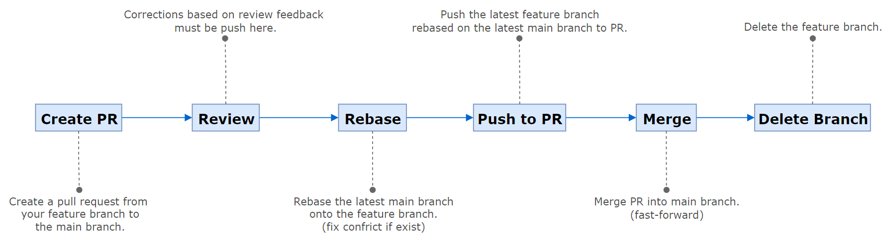

# バージョン管理方針

本項ではソースコードのバージョン管理方針、推奨事項について定める。

## 基本方針

- AWS CodeCommit を用いたソースコードのバージョン管理を行う。
- 各種アプリケーションのソースコードは、領域ごとにそれぞれ単一のリポジトリに保存して管理する。（[モノレポ](https://en.wikipedia.org/wiki/Monorepo)）
- main ブランチでのソースコードの変更、main ブランチへの直接的な PUSH は禁止とする。必ず プルリクエスト (PR) を経由してマージすること。
- 作業ブランチは main ブランチから作成すること。ただし、関連課題や他課題との不要な Conflict の発生が見込まれる場合は、develop ブランチに相当する作業ブランチから分岐することを許容する。

## ブランチ運用ルール



### Create PR (Pull Request)
開発完了後、作業ブランチから main ブランチへ プルリクエスト を作成する。  
プルリクエスト作成後、レビュアーにレビュー依頼を通知する。

### Review
1名以上のレビュアーによるコードレビューを必須とする。  
レビュー方式（e.g. In-person Review, Desk Review）は必要に応じて任意とする。 

#### レビュー観点例
以下に列挙する例のとおり、正しさ、読みやすさ、安全性、効率性などを観点にコードレビューを行うこと。

1. 動作が要件、設計内容を満たしているか。
2. バグやロジックの矛盾はないか。冗長なコードがないか。
3. 再利用性を考慮した構造になっているか。
4. 変数・関数・クラスなど、規約に沿って一貫した命名となっているか。
5. 未使用のコードやデバッグ分が残っていないか。
6. 複雑な処理の説明など、コメントの記述に過不足がないか。
7. パフォーマンス、セキュリティの配慮があるか。

またフィードバックに基づくプロジェクトの修正はここで作業ブランチに都度プッシュし、変更箇所を常に最新化すること。  

### Reabase and push to PR
最新の main ブランチを作業ブランチに Rebase する。（Conflict が発生した場合は修正を行う）  
最新の作業ブランチを PR に PUSH する。

### Merge
レビューとソースコードの最新化が完了後、main ブランチへの merge を行う。
マージ方法は fast-forward とする。  

単一のタスクに対する修正が 複数回 main ブランチに merge されることを回避するため、  
main ブランチへの merge は、日本側のレビュー（内部受入）が完了した後に行うことが望ましい。  
日本側レビュー（内部受入）後のお客様受入時に発生した修正事項は、別途作業ブランチを新たに作成してプログラムの修正を行うこと。  

### Delete Branch

main ブランチへの merge が完了した 作業ブランチは削除すること。

## 補足: commit

Commit メッセージにあたっては、[Semantic Commit Messages](https://gist.github.com/joshbuchea/6f47e86d2510bce28f8e7f42ae84c716) を参考に以下のような記述方法の採用を推奨する。 

Format: `<type>: <program id> <subject> #<issue number>` 


| 項目                | 説明                                            |
| ----------------- | --------------------------------------------- |
| `<type>`          | Commit 内容を簡潔に示すための Prefix                     |
| `<program id>`    | 対象のプログラムID                                    |
| `<subject>`       | Commit 内容の表題                                  |
| `#<issue number>` | 課題No. や 日付など。Commit 内容に対し、対象が明確である場合は記述を強く推奨。 |

`<type>` の例   
  - `feat`    : （ユーザー向けの新機能。ビルドスクリプトの新機能ではない）
  - `fix`     : （ユーザー向けのバグ修正。ビルドスクリプトの修正ではない）
  - `docs`    : （ドキュメントの変更）
  - `style`   : （フォーマット修正、セミコロンの抜けなど。プロダクションコードの変更はなし）
  - `refactor`: （プロダクションコードのリファクタリング。例: 変数名の変更）
  - `test`    : （不足しているテストの追加、テストのリファクタリング。プロダクションコードの変更はなし）
  - `chore`   : （Grunt タスクなどの更新。プロダクションコードの変更はなし）


e.g.
```
feat: ZXXR000 update search form #0000
fix: ZXXR000 registration bug fix #0000
```

Description 欄の記述は任意とする。  
また git コマンドを頻繁に実行する場合は、実行ミスの防止を目的として以下のような GUI ツールの使用を推奨する。

- [Fork](https://git-fork.com/)
- [GitHub Desktop](https://desktop.github.com/download/)
- [SourceTree](https://www.sourcetreeapp.com/)

## 補足: GitHub flow

開発者の効果的な共同作業の推進のため、ブランチ戦略は [GitHub flow](https://docs.github.com/en/get-started/using-github/github-flow) をベースとしている。

GitHub flow は、“main” と “feature” の2種のブランチで構成された、Git-flow や GitLab flow と比較してシンプルなフロー。  
必要に応じて開発統合を目的とした “develop” ブランチの作成を許可する。  


| ブランチ        | 用途                                  | 例        |
| ----------- | ----------------------------------- | -------- |
| main        | リリース用またはプロジェクト最新のソースコードが保存された安定ブランチ | -        |
| develop     | 開発統合ブランチ(任意)                        | -        |
| feature/xxx | 開発用ブランチ                             | feature/login-form |

本アプリケーション開発においては、動作検証やレビューを目的とした開発用ブランチからの開発機へのデプロイを許可する。  
※ 一般的な運用では、 環境へのデプロイは main, develop 等の統合ブランチからのみ行う。


