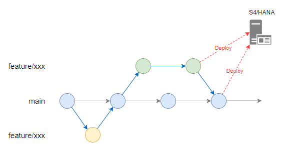

# Chính sách quản lý phiên bản

Phần này xác định chính sách và các khuyến nghị về quản lý phiên bản mã nguồn.

## Chính sách cơ bản

- Sử dụng AWS CodeCommit để quản lý phiên bản mã nguồn.  
- Lưu trữ và quản lý mã nguồn của từng ứng dụng trong một kho lưu trữ duy nhất cho mỗi phạm vi (xem [Monorepo](https://en.wikipedia.org/wiki/Monorepo)).  
- Cấm thay đổi hoặc push trực tiếp vào nhánh main. Tất cả các thay đổi phải được merge thông qua Pull Request (review).  
- Nhánh làm việc nên được tạo từ nhánh main. Tuy nhiên, nếu dự kiến sẽ phát sinh xung đột với các tác vụ liên quan hoặc tác vụ khác, được phép tạo nhánh từ một nhánh làm việc tương đương với nhánh develop.  

## Quy tắc vận hành nhánh

### Tạo PR (Pull Request)
Sau khi phát triển hoàn tất, tạo Pull Request từ nhánh làm việc sang nhánh main.  
Khi Pull Request đã được tạo, thông báo cho reviewer để yêu cầu xem xét.

### Review
Ít nhất một reviewer phải thực hiện code review.  
Phương pháp review (ví dụ: In-person Review, Desk Review) có thể được lựa chọn tùy theo nhu cầu.  

#### Ví dụ về các điểm cần xem xét
Như liệt kê dưới đây, code review cần được thực hiện dựa trên tính chính xác, khả năng đọc, độ an toàn, hiệu suất, và các yếu tố khác:

1. Chương trình có đáp ứng yêu cầu và thiết kế hay không?
2. Có bug hoặc mâu thuẫn logic nào không? Code có dư thừa hay không?
3. Cấu trúc có được thiết kế để tái sử dụng hay không?
4. Tên biến, hàm, lớp có được đặt nhất quán theo quy ước không?
5. Có còn lại đoạn code không sử dụng hoặc lệnh debug không?
6. Comment cho các xử lý phức tạp có đầy đủ, vừa phải và không dư thừa không?
7. Đã xem xét đến hiệu suất và bảo mật chưa?

Dựa trên phản hồi, các chỉnh sửa cần được push lên nhánh làm việc, đảm bảo thay đổi luôn được cập nhật mới nhất.  

### Rebase và Push lên PR
Rebase nhánh làm việc với nhánh main mới nhất (nếu xảy ra conflict thì cần xử lý).  
Push nhánh làm việc đã được cập nhật lên Pull Request.

### Merge
Khi review và cập nhật code đã hoàn tất, tiến hành merge vào nhánh main.  
Phương thức merge sẽ là fast-forward.  

Để tránh việc merge nhiều lần các sửa đổi cho cùng một tác vụ vào nhánh main,  
việc merge vào nhánh main nên được thực hiện sau khi review bởi phía Nhật Bản (internal acceptance) hoàn tất.  
Các sửa đổi phát sinh trong quá trình chấp nhận của khách hàng sau khi review của phía Nhật Bản (internal acceptance) nên được thực hiện trong một nhánh làm việc riêng mới tạo.

### Xóa Branch
Xóa nhánh làm việc sau khi merge vào nhánh main đã hoàn tất.

## Ghi chú: commit

Khi viết commit message, khuyến khích áp dụng phong cách được mô tả trong [Semantic Commit Messages](https://gist.github.com/joshbuchea/6f47e86d2510bce28f8e7f42ae84c716).

Format: `<type>: <program id> <subject> #<issue number>`

| Mục               | Giải thích                                                                    |
| ----------------- | ----------------------------------------------------------------------------- |
| `<type>`          | Tiền tố dùng để diễn đạt ngắn gọn nội dung commit                              |
| `<program id>`    | ID của chương trình liên quan                                                  |
| `<subject>`       | Tiêu đề tóm tắt nội dung commit                                                |
| `#<issue number>` | Số issue hoặc ngày tháng. Rất khuyến khích nếu giúp xác định rõ phạm vi commit. |

Ví dụ về `<type>`   
- `feat`    : Tính năng mới dành cho người dùng (không phải tính năng mới cho build script)  
- `fix`     : Sửa lỗi dành cho người dùng (không phải sửa lỗi cho build script)  
- `docs`    : Thay đổi tài liệu  
- `style`   : Sửa định dạng, thiếu dấu chấm phẩy, v.v. (không thay đổi mã sản xuất)  
- `refactor`: Refactor mã sản xuất (ví dụ: đổi tên biến)  
- `test`    : Thêm các test còn thiếu hoặc refactor test (không thay đổi mã sản xuất)  
- `chore`   : Cập nhật các task như Grunt (không thay đổi mã sản xuất)  

e.g.
```
feat: ZXXR000 update search form #0000
fix: ZXXR000 registration bug fix #0000
```

Việc điền vào cột Description là tùy chọn.  
Ngoài ra, nếu bạn thường xuyên sử dụng các lệnh Git, nên sử dụng các công cụ GUI như dưới đây để giảm thiểu sai sót:

- [Fork](https://git-fork.com/)  
- [GitHub Desktop](https://desktop.github.com/download/)  
- [SourceTree](https://www.sourcetreeapp.com/)

### merge

Việc merge vào nhánh main phải thông qua Pull Request (review).  
Để tránh việc merge nhiều lần các sửa đổi cho cùng một tác vụ vào nhánh main,  
việc merge vào nhánh main nên được thực hiện sau khi review bởi phía Nhật Bản (internal acceptance) hoàn tất.  
Các sửa đổi phát sinh trong quá trình chấp nhận của khách hàng sau khi review của phía Nhật Bản (internal acceptance) nên được thực hiện trong một nhánh làm việc riêng mới tạo.

## Ghi chú: GitHub flow
Để thúc đẩy sự hợp tác hiệu quả giữa các nhà phát triển, chiến lược nhánh sẽ dựa trên [GitHub flow](https://docs.github.com/en/get-started/using-github/github-flow).

GitHub flow là một quy trình làm việc đơn giản chỉ bao gồm hai loại nhánh **main** và **feature**, trái ngược với các chiến lược phức tạp hơn như Git-flow hoặc GitLab flow.  
Khi cần thiết, cho phép tạo nhánh **develop** nhằm mục đích tích hợp phát triển.


| Nhánh        | Mục đích                                                                | Ví dụ               |
| ------------ | ----------------------------------------------------------------------- | ------------------- |
| main         | Nhánh ổn định, chứa mã nguồn sẵn sàng phát hành hoặc mới nhất của dự án  | -                   |
| develop      | Nhánh tích hợp cho phát triển (tùy chọn)                                | -                   |
| feature/xxx  | Nhánh phát triển cho từng tính năng hoặc sửa lỗi                         | feature/login-form  |

Trong quá trình phát triển ứng dụng này, cho phép triển khai lên môi trường phát triển từ các nhánh feature nhằm mục đích kiểm thử và review.  
※ Trong vận hành thông thường, việc triển khai lên môi trường chỉ được thực hiện từ các nhánh tích hợp như **main** hoặc **develop**.


