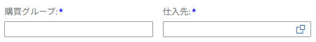
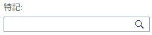
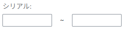
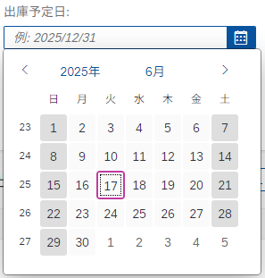

# INPUT形式
Fiori FreeStyle アプリケーション で主に使用するINPUT形式のパターンについて列挙する。  

## 0. 全体

### Alignment
Text 表記 および 各種入力形式に応じた Input の Alignment を下表のとおり定める。  
※ 下表に指定がないものは原則 Alignment = Left とする。

| Item type        | Alignment | sap.ui.core.TextAlign |
| ---------------- | --------- | --------------------- |
| 文字列           | Left      | `Begin`               |
| 日付             | Left      | `Begin`               |
| 数値             | Right     | `End`                 |
| 数量             | Right     | `End`                 |
| 金額             | Right     | `End`                 |
| 通貨             | Left      | `Begin`               |

**Reference:** [sap.ui.core.TextAlign](https://sapui5.hana.ondemand.com/sdk/#/api/sap.ui.core.TextAlign)

## 1. 必須入力項目

必須入力項目には、項目名に**赤字**の Suffix (*) を追加する。

### 1-1. 検索条件部(FilterBar)


対象となる Input の `FilterGroupItem` に `mandatory=true` を設定する。  
バリデーションは検索処理時に実行すること。

```xml
    <!-- e.g. -->
    <fb:FilterGroupItem
        id="FILTER001"
        groupName="group1"
        name="proj"
        label="{i18n>proj}"
        visibleInFilterBar="true"
        mandatory="true"
    >
        <fb:control>
            <Input
                id="INPSPH001"
                value="{screen>/proj}"
                enabled="true"
                maxLength="10"
                submit="onPressSearchButton"
            />
        </fb:control>
    </fb:FilterGroupItem>

```

### 1-2. 一覧表示部(Table)


対象となる Input に対応する `Label` に `required=true` を設定する。  
バリデーションは登録処理時に実行すること。

```xml
    <!-- e.g. -->
    <table:Column
        id="COLUMN01"
        width="8.5rem"
        name="{i18n>columnName01}"
        hAlign="Center"
    >
        <Label
            id="LABEL001"
            text="{i18n>columnName01}"
            required="true"
        />
        <table:template>
            <VBox id="VBOX001">
                <Input 
                    id="REQUIRED001" 
                    required="true"
                    value="{oDataTable>requiredValue}" 
                    maxLength="24" 
                    visible="{= ${oDataTable>flag} === 'I' }" 
                    valueState="{oDataTable>valueStateReq}" 
                    valueStateText="{oDataTable>valueStateTextReq}" 
                    change="onChangeRowField" 
                    liveChange="onAutoSelectCheckbox"
                    textAlign="Begin"
                />
            </VBox>
        </table:template>
    </table:Column>

```


## 2. いずれか必須入力(検索)

**※ お客様固有の要件。Fiori 標準仕様ではない。**  
検索条件部において複数の項目に対していずれか一つ以上の入力を必須とする場合、項目名に**青字**の Suffix (*) を追加する。  

### 2-1. 検索条件部(FilterBar)



対象となる Input の `FilterGroupItem` に `mandatory=true` を設定する。  
カスタムCSS ( `style.css` ) から SAPUI5の標準 Style Class に定義された **赤字** の Suffix (*) を **青字** に Override する。  
バリデーションは検索処理時に実行すること。

```css
    /* Change mandatory(*) color in required fields */
    .sapUiCompFilterBar span.sapMLabelColonAndRequired::after {
        color: blue !important;
    }
```

#### 必須入力項目が混在する場合

検索条件部に通常の必須入力項目も含まれる場合は、専用の Style Class を定義した項目のみ適用する。

```xml
    <!-- e.g. Required -->
    <fb:FilterGroupItem
        id="FILTER001"
        groupName="group1"
        name="ekgrp"
        label="{i18n>purchase}"
        visibleInFilterBar="true"
        mandatory="true"
    >
        <fb:control>
            <Input
                id="EKGRP001"
                maxLength="10"
                value="{screen>/ekgrp}"
                submit="onPressSearchButton"
            />
        </fb:control>
    </fb:FilterGroupItem>
    <!-- e.g. any of these required / add custom class -->
    <fb:FilterGroupItem
        id="FILTER002"
        groupName="group1"
        name="invoice"
        label="{i18n>invoice}"
        visibleInFilterBar="true"
        mandatory="true"
    >
        <fb:control>
            <Input
                id="INVOICE001"
                value="{screen>/invoice}"
                class="blueMandatory"
                submit="onPressSearchButton"
            />
        </fb:control>
    </fb:FilterGroupItem>
```

```css
    /* Change mandatory(*) color of only the fields that has class 'blueMandatory'. */
    .sapUiAFLayoutItem:has(div.blueMandatory) .sapMLabelColonAndRequired::after {
        color: blue !important;
    }
```

## 3. 部分一致(検索)

**※ お客様固有の要件。Fiori 標準仕様ではない。**  
検索条件部の項目における「部分一致検索（あいまい検索）」を行うテキスト入力項目に対し、Input の末尾に虫眼鏡のアイコン（）を設置する。



対象の Input にStyle Class `inputIconRight search` を追加し、  
カスタムCSS ( `style.css` ) から SAPUI5の標準 Style Class を Override する。
※ 今後異なるパターンのアイコン設置を考慮し、Style Class を 分割している。

```xml
    <!-- e.g. -->
    <Input
        id="READTEXT001"
        value="{screen>/ReadText}"
        enabled="true"
        maxLength="100"
        submit="onPressSearchButton"
        class="inputIconRight search"
    />
```

```css
    .inputIconRight .sapMInputBaseContentWrapper {
        padding-right: 1.25rem;
    }

    .sapUiSizeCompact .inputIconRight .sapMInputBaseContentWrapper:after {
        font-family: 'SAP-icons';
        margin-top: 0.25rem;
        font-size: 1rem;
        margin-right: -0.7rem;
    }

    .inputIconRight.search .sapMInputBaseContentWrapper:after {
        content: '\e00d';
    }
```

## 4. テキスト項目
**API Reference:** [class sap.m.Input](https://sapui5.hana.ondemand.com/sdk/#api/sap.m.Input)  
**Control Sample:** [sap.m.Input](https://sapui5.hana.ondemand.com/sdk/#/entity/sap.m.Input)

桁数や、入力制約（e.g. 英数字のみ入力可）は要件に応じて設定すること。

### 4-1. 文字列

  

```xml
    <!-- e.g. -->
    <Input
        id="PWBS001"
        value="{screen>/pwbs}"
        enabled="true"
        maxLength="24"
        submit="onPressSearchButton"
    />
```

### 4-2. 数値 / 数量
数量項目は**整数入力のみ**に制限する。  
数値項目はその種類、要件に応じて入力制限を設けること。

| Item type | input possible | e.g.             | Regex                     |
| --------- | -------------- | ---------------- | ------------------------- |
| 数量        | 整数のみ           | 在庫数              | `/^-?\d+$/`               |
| 数量        | 整数のみ           | 発注数              | `/^-?\d+$/`               |
| 数量        | 整数のみ           | ロット数             | `/^-?\d+$/`               |
| 数値        | 整数のみ           | 長さ、距離（cm, m, km) | `/^-?\d+$/`               |
| 数値        | 小数点第1位まで       | 時間(h, min, sec)  | `/^(-?\d+)(\.\d)?$/`      |
| 数値        | 小数点第2位まで       | 単価               | `/^(-?\d+)(\.\d{1,2})?$/` |

```xml
    <!-- e.g. -->
    <Input 
        id="NUM001"
        value="{oDataTable>numericValue}"
        liveChange="onliveChange"
        textAlign="End"
        visible="{
            parts: ['oDataTable>flagStatus'], 
            formatter: '.onFormatEditable'
        }" 
    />
```

### 4-3. 金額
金額項目は、対応する通貨項目の指定値（e.g. `JPY`, `USD`）に基づく表記を原則とする。  
通貨に応じた動的な表記変更を考慮すること。  
表記変更処理は JavaScript 標準オブジェクトの [Intl](https://developer.mozilla.org/ja/docs/Web/JavaScript/Reference/Global_Objects/Intl) を使用すること。

```xml
    <!-- e.g. -->
    <Input id="AMOUNT001" 
        value="{
            parts:['oDataTable>amount', 'oDataTable>currency'],
            type: 'sap.ui.model.type.Currency',
            formatOptions: {showMeasure: false},
            formatter : '.currencyInputFormatter'
        }" 
        maxLength="18" 
        visible="{
            parts: ['oDataTable>Operation'], 
            formatter: '.onFormatEditable'
        }" 
        liveChange="onAmountOfMoneyChange"
    />
```

```javascript
    // e.g.
    // Representation conversion is performed within the created Formatter library.
    /**
     *  Format money on Input value
     * @param {String} sCurrency
     * @returns String currency formatted 123,456,789.00
     */
    currencyInputFormatter: function (sMoney, sCurrency) {
        return Formatter.DisplayMoneyFormatter(sMoney, sCurrency, true, true);
    },
```

### 4-4. 範囲指定

数量、数値などの範囲指定入力。  
Input Group 内に 2 つのInput (FROM-TO) を設置する。

  

```xml
    <!-- e.g. -->
    <HBox id="HBox001">
        <Input
            id="NUMFROM001"
            type="Text"
            value="{screen>/numericValueFrom}"
            maxLength="3"
            width="100%"
            submit="onPressSearchButton"
        />
        <Text
            id="UNTILTEXT001"
            text="~"
            class="sapUiSmallMarginBeginEnd sapUiTinyMarginTop"/>
        <Input
            id="NUMTO001"
            type="Text"
            value="{screen>/numericValueTo}"
            maxLength="3"
            width="100%"
            submit="onPressSearchButton"
        />
    </HBox>
```

## 5. 日付

### 5-1. 単一選択
**API Reference:** [class sap.m.DatePicker](https://sapui5.hana.ondemand.com/sdk/#api/sap.m.DatePicker)  
**Control Sample:** [sap.m.DatePicker](https://sapui5.hana.ondemand.com/sdk/#/entity/sap.m.DatePicker)

カレンダー（DatePicker）から単一の日付を選択する項目。  

| 日付  | displayFormat |
| --- | ------------- |
| 年月日 | `yyyy/MM/dd`  |
| 年月  | `yyyy/MM`     |
| 年   | `yyyy`        |


```xml
    <!-- e.g. -->
    <DatePicker
        id="DATE001" 
        displayFormat="yyyy/MM/dd" 
        value="{oDataTable>dateValue}" 
        visible="{
            parts: ['oDataTable>Operation'],
            formatter: '.onFormatVisibleCase01'
        }"
        textAlign="Begin"
        change="onChangeDate"
    />
```

### 5-2. 範囲選択
**API Reference:** [class sap.m.DateRangeSelection](https://sapui5.hana.ondemand.com/sdk/#api/sap.m.DateRangeSelection)  
**Control Sample:** [sap.m.DateRangeSelection](https://sapui5.hana.ondemand.com/sdk/#/entity/sap.m.DateRangeSelection)

カレンダー（DatePicker）から日付の範囲 (FROM-TO) を選択する項目。  


| 日付  | displayFormat |
| --- | ------------- |
| 年月日 | `yyyy/MM/dd`  |
| 年月  | `yyyy/MM`     |
| 年   | `yyyy`        |

  

```xml
    <!-- e.g. -->
    <DateRangeSelection
        id="DATERANGE001"
        displayFormat="yyyy/MM/dd"
        value="{screen>/dateValue}"
        dateValue="{screen>/dateValueFrom}"
        secondDateValue="{screen>/dateValueTo}"
    />
```

要件によっては、DateRangeSelection ではなく DatePicker で範囲選択を行うケースもある。


## 6. ラジオボタン
**API Reference:** [class sap.m.RadioButtonGroup](https://sapui5.hana.ondemand.com/sdk/#api/sap.m.RadioButtonGroup), [class sap.m.RadioButton](https://sapui5.hana.ondemand.com/sdk/#api/sap.m.RadioButton)  
**Control Sample:** [sap.m.RadioButtonGroup](https://sapui5.hana.ondemand.com/sdk/#/entity/sap.m.RadioButtonGroup), [sap.m.RadioButton](https://sapui5.hana.ondemand.com/sdk/#/entity/sap.m.RadioButton)


選択肢が固定の単一選択に使用する。

  

```xml
    <!-- e.g. -->
    <RadioButtonGroup
        id="RADIOBTNGRP001"
        select="onChangeRadioSelected"
    >
        <RadioButton
            id="RADIO001"
            text="{i18n>label001}"
        />
        <RadioButton
            id="RADIO002"
            text="{i18n>label002}"
        />
    </RadioButtonGroup>
```

## 7. チェックボックス
**API Reference:** [class sap.m.CheckBox](https://sapui5.hana.ondemand.com/sdk/#api/sap.m.CheckBox)  
**Control Sample:** [sap.m.CheckBox](https://sapui5.hana.ondemand.com/sdk/#/entity/sap.m.CheckBox)

フラグの指定や選択した固定の複数選択に使用する。

  

```xml
    <!-- e.g. -->
    <HBox id="HBox002">
        <CheckBox
            id="CHECKBOX001"
            text="{i18n>label001}"
            select="onSelect"
        />
    </Hbox>
```

## 8. ドロップダウン (プルダウン)

### 8-1. 単一選択
**API Reference:** [class sap.m.ComboBox](https://sapui5.hana.ondemand.com/sdk/#api/sap.m.ComboBox)  
**Control Sample:** [sap.m.ComboBox](https://sapui5.hana.ondemand.com/sdk/#/entity/sap.m.ComboBox)

単一選択のコンボボックス。


```xml
    <!-- e.g. -->
    <ComboBox
        id="COMBO001"
        change="onChangeComboBox"
        showSecondaryValues="false"
        items="{path : 'dropdown>/items'}"
    >
        <core:ListItem
            key="{dropdown>key}"
            text="{dropdown>value}"
        />
    </ComboBox>
```

### 8-2. 複数選択
**API Reference:** [class sap.m.MultiComboBox](https://sapui5.hana.ondemand.com/sdk/#api/sap.m.MultiComboBox)  
**Control Sample:** [sap.m.MultiComboBox](https://sapui5.hana.ondemand.com/sdk/#/entity/sap.m.MultiComboBox)


複数選択が可能なマルチコンボボックス。

  

```xml
    <!-- e.g. -->
    <MultiComboBox
        id="MCOMBO001"
        selectionFinish="handleSelectionFinish"
        items="{ path: 'dropdown>/items' }"
        showSecondaryValues= "true"
        >
        <core:ListItem
            id="_IDGenItem1"
            key="{dropdown>code}"
            text="{dropdown>text}"
            additionalText="{dropdown>code}"
        />
    </MultiComboBox>
```

## 9. ファイル選択
**API Reference:** [class sap.ui.unified.FileUploader](https://sapui5.hana.ondemand.com/sdk/#api/sap.ui.unified.FileUploader)  
**Control Sample:** [sap.ui.unified.FileUploader](https://sapui5.hana.ondemand.com/#/entity/sap.ui.unified.FileUploader)


ファイル選択INPUT。ファイルの読み込みやアップロードに使用。

  


## 10. 検索ヘルプ
**API Reference:** [class sap.m.SelectDialog](https://sapui5.hana.ondemand.com/#/api/sap.m.SelectDialog), [class sap.ui.comp.valuehelpdialog.ValueHelpDialog](https://sapui5.hana.ondemand.com/sdk/#api/sap.ui.comp.valuehelpdialog.ValueHelpDialog)  

目的にあわせた検索ヘルプダイアログから単一もしくは複数選択。  
検索ヘルプの種類については、「[検索ヘルプの種類](./guide-valuehelp-dialog-design.md)」を参照してください。

  

