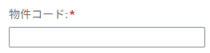
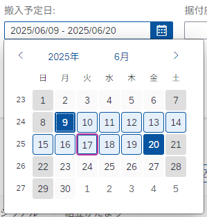
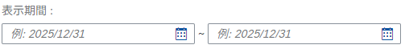
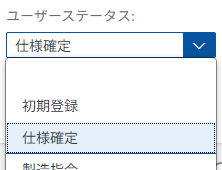
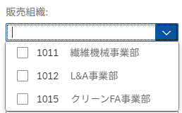

# INPUT Formats
This section lists the main INPUT format patterns used in Fiori FreeStyle applications.

## General

### Alignment
The alignment of Text elements and various Input types is defined in the table below.  
※ For items not listed in the table, the default alignment is Left.

| Item type        | Alignment | sap.ui.core.TextAlign |
| ---------------- | --------- | --------------------- |
| String           | Left      | `Begin`               |
| Date             | Left      | `Begin`               |
| Number           | Right     | `End`                 |
| Quantity         | Right     | `End`                 |
| Amount           | Right     | `End`                 |
| Currency         | Left      | `Begin`               |

**Reference:** [sap.ui.core.TextAlign](https://sapui5.hana.ondemand.com/sdk/#/api/sap.ui.core.TextAlign)

## Required Input Fields

For required input fields, add a **red** suffix (*) to the field name.

### Search Criteria Section (FilterBar)


Set `mandatory=true` on the `FilterGroupItem` of the target Input.  
Validation should be performed during the search process.

```xml
    <!-- e.g. -->
    <fb:FilterGroupItem
        id="FILTER001"
        groupName="group1"
        name="proj"
        label="{i18n>proj}"
        visibleInFilterBar="true"
        mandatory="true"
    >
        <fb:control>
            <Input
                id="INPSPH001"
                value="{screen>/proj}"
                enabled="true"
                maxLength="10"
                submit="onPressSearchButton"
            />
        </fb:control>
    </fb:FilterGroupItem>

```

### List Display Section (Table)


Set `required=true` on the `Label` corresponding to the target Input.  
Validation should be performed during the registration process.

```xml
    <!-- e.g. -->
    <table:Column
        id="COLUMN01"
        width="8.5rem"
        name="{i18n>columnName01}"
        hAlign="Center"
    >
        <Label
            id="LABEL001"
            text="{i18n>columnName01}"
            required="true"
        />
        <table:template>
            <VBox id="VBOX001">
                <Input 
                    id="REQUIRED001" 
                    required="true"
                    value="{oDataTable>requiredValue}" 
                    maxLength="24" 
                    visible="{= ${oDataTable>flag} === 'I' }" 
                    valueState="{oDataTable>valueStateReq}" 
                    valueStateText="{oDataTable>valueStateTextReq}" 
                    change="onChangeRowField" 
                    liveChange="onAutoSelectCheckbox"
                    textAlign="Begin"
                />
            </VBox>
        </table:template>
    </table:Column>

```

## At Least One Required Input (Search)

**※ Customer-specific requirement. Not a standard Fiori specification.**  
When at least one input among multiple fields in the search criteria section is required, add a **blue** suffix (*) to the field names.

### Search Criteria Section (FilterBar)


Set `mandatory=true` on the `FilterGroupItem` of the target Inputs.  
Override the standard SAPUI5 **red** suffix (*) defined in the Style Class with **blue** via custom CSS (`style.css`).  
Validation should be performed during the search process.

```css
    /* Change mandatory(*) color in required fields */
    .sapUiCompFilterBar span.sapMLabelColonAndRequired::after {
        color: blue !important;
    }
```

#### When Required Inputs Are Mixed

If the search criteria section includes regular required input fields as well, apply the custom Style Class only to the designated fields.

```xml
    <!-- e.g. Required -->
    <fb:FilterGroupItem
        id="FILTER001"
        groupName="group1"
        name="ekgrp"
        label="{i18n>purchase}"
        visibleInFilterBar="true"
        mandatory="true"
    >
        <fb:control>
            <Input
                id="EKGRP001"
                maxLength="10"
                value="{screen>/ekgrp}"
                submit="onPressSearchButton"
            />
        </fb:control>
    </fb:FilterGroupItem>
    <!-- e.g. any of these required / add custom class -->
    <fb:FilterGroupItem
        id="FILTER002"
        groupName="group1"
        name="invoice"
        label="{i18n>invoice}"
        visibleInFilterBar="true"
        mandatory="true"
    >
        <fb:control>
            <Input
                id="INVOICE001"
                value="{screen>/invoice}"
                class="blueMandatory"
                submit="onPressSearchButton"
            />
        </fb:control>
    </fb:FilterGroupItem>
```

```css
    /* Change mandatory(*) color of only the fields that has class 'blueMandatory'. */
    .sapUiAFLayoutItem:has(div.blueMandatory) .sapMLabelColonAndRequired::after {
        color: blue !important;
    }
```

## 部分一致(検索)

## Partial Match (Search)

**※ Customer-specific requirement. Not a standard Fiori specification.**  
**※ This Input specification is limited to the Production (PPPS) and Purchasing (MM) areas.**  
For text input fields used for partial match (fuzzy search) in the search criteria section, place a magnifying glass icon () at the end of the Input.


Add the Style Class `inputIconRight search` to the target Input,  
and override the standard SAPUI5 Style Class via custom CSS (`style.css`).  
※ The Style Classes are separated to accommodate different icon placement patterns in the future.

```xml
    <!-- e.g. -->
    <Input
        id="READTEXT001"
        value="{screen>/ReadText}"
        enabled="true"
        maxLength="100"
        submit="onPressSearchButton"
        class="inputIconRight search"
    />
```

```css
    .inputIconRight .sapMInputBaseContentWrapper {
        padding-right: 1.25rem;
    }

    .sapUiSizeCompact .inputIconRight .sapMInputBaseContentWrapper:after {
        font-family: 'SAP-icons';
        margin-top: 0.25rem;
        font-size: 1rem;
        margin-right: -0.7rem;
    }

    .inputIconRight.search .sapMInputBaseContentWrapper:after {
        content: '\e00d';
    }
```

## Text Fields
**API Reference:** [class sap.m.Input](https://sapui5.hana.ondemand.com/sdk/#api/sap.m.Input)  
**Control Sample:** [sap.m.Input](https://sapui5.hana.ondemand.com/sdk/#/entity/sap.m.Input)

Set the number of characters and input constraints (e.g., alphanumeric only) according to the requirements.

### String


```xml
    <!-- e.g. -->
    <Input
        id="PWBS001"
        value="{screen>/pwbs}"
        enabled="true"
        maxLength="24"
        submit="onPressSearchButton"
    />
```

### Number / Quantity
Quantity fields are restricted to **integer input only**.  
Numeric fields should have input restrictions according to their type and requirements.

| Item type | Input allowed     | e.g.                  | Regex                     |
| --------- | ---------------- | -------------------- | ------------------------- |
| Quantity  | Integers only     | Stock quantity        | `/^-?\d+$/`               |
| Quantity  | Integers only     | Order quantity        | `/^-?\d+$/`               |
| Quantity  | Integers only     | Lot size              | `/^-?\d+$/`               |
| Number    | Integers only     | Length, Distance (cm, m, km) | `/^-?\d+$/`      |
| Number    | Up to 1 decimal   | Time (h, min, sec)   | `/^(-?\d+)(\.\d)?$/`      |
| Number    | Up to 2 decimals  | Unit price            | `/^(-?\d+)(\.\d{1,2})?$/` |

```xml
    <!-- e.g. -->
    <Input 
        id="NUM001"
        value="{oDataTable>numericValue}"
        liveChange="onliveChange"
        textAlign="End"
        visible="{
            parts: ['oDataTable>flagStatus'], 
            formatter: '.onFormatEditable'
        }" 
    />
```

### Amount
Amount fields should, in principle, be displayed according to the corresponding currency field (e.g., `JPY`, `USD`).  
Consider dynamic display changes according to the currency.  
Use the JavaScript standard object [Intl](https://developer.mozilla.org/en-US/docs/Web/JavaScript/Reference/Global_Objects/Intl) for formatting changes.

```xml
    <!-- e.g. -->
    <Input id="AMOUNT001" 
        value="{
            parts:['oDataTable>amount', 'oDataTable>currency'],
            type: 'sap.ui.model.type.Currency',
            formatOptions: {showMeasure: false},
            formatter : '.currencyInputFormatter'
        }" 
        maxLength="18" 
        visible="{
            parts: ['oDataTable>Operation'], 
            formatter: '.onFormatEditable'
        }" 
        liveChange="onAmountOfMoneyChange"
    />
```

```javascript
    // e.g.
    // Representation conversion is performed within the created Formatter library.
    /**
     *  Format money on Input value
     * @param {String} sCurrency
     * @returns String currency formatted 123,456,789.00
     */
    currencyInputFormatter: function (sMoney, sCurrency) {
        return Formatter.DisplayMoneyFormatter(sMoney, sCurrency, true, true);
    },
```

### Range Input

Range input for quantities, numbers, etc.  
Place two Inputs (FROM-TO) within an Input Group.


```xml
    <!-- e.g. -->
    <HBox id="HBox001">
        <Input
            id="NUMFROM001"
            type="Text"
            value="{screen>/numericValueFrom}"
            maxLength="3"
            width="100%"
            submit="onPressSearchButton"
        />
        <Text
            id="UNTILTEXT001"
            text="~"
            class="sapUiSmallMarginBeginEnd sapUiTinyMarginTop"/>
        <Input
            id="NUMTO001"
            type="Text"
            value="{screen>/numericValueTo}"
            maxLength="3"
            width="100%"
            submit="onPressSearchButton"
        />
    </HBox>
```

## Date

### Single Selection
**API Reference:** [class sap.m.DatePicker](https://sapui5.hana.ondemand.com/sdk/#api/sap.m.DatePicker)  
**Control Sample:** [sap.m.DatePicker](https://sapui5.hana.ondemand.com/sdk/#/entity/sap.m.DatePicker)

An item for selecting a single date from a calendar (DatePicker).  

| Date | displayFormat |
| ---- | ------------- |
| Year-Month-Day | `yyyy/MM/dd`  |
| Year-Month     | `yyyy/MM`     |
| Year           | `yyyy`        |


```xml
    <!-- e.g. -->
    <DatePicker
        id="DATE001" 
        displayFormat="yyyy/MM/dd" 
        value="{oDataTable>dateValue}" 
        visible="{
            parts: ['oDataTable>Operation'],
            formatter: '.onFormatVisibleCase01'
        }"
        textAlign="Begin"
        change="onChangeDate"
    />
```

### Range Selection
**API Reference:** [class sap.m.DateRangeSelection](https://sapui5.hana.ondemand.com/sdk/#api/sap.m.DateRangeSelection)  
**Control Sample:** [sap.m.DateRangeSelection](https://sapui5.hana.ondemand.com/sdk/#/entity/sap.m.DateRangeSelection)

An item for selecting a date range (FROM-TO) from a calendar (DatePicker).  

| Date | displayFormat |
| ---- | ------------- |
| Year-Month-Day | `yyyy/MM/dd`  |
| Year-Month     | `yyyy/MM`     |
| Year           | `yyyy`        |



```xml
    <!-- e.g. -->
    <DateRangeSelection
        id="DATERANGE001"
        displayFormat="yyyy/MM/dd"
        value="{screen>/dateValue}"
        dateValue="{screen>/dateValueFrom}"
        secondDateValue="{screen>/dateValueTo}"
    />
```

Depending on requirements, range selection may also be performed using a DatePicker instead of DateRangeSelection.



## Radio Button
**API Reference:** [class sap.m.RadioButtonGroup](https://sapui5.hana.ondemand.com/sdk/#api/sap.m.RadioButtonGroup), [class sap.m.RadioButton](https://sapui5.hana.ondemand.com/sdk/#api/sap.m.RadioButton)  
**Control Sample:** [sap.m.RadioButtonGroup](https://sapui5.hana.ondemand.com/sdk/#/entity/sap.m.RadioButtonGroup), [sap.m.RadioButton](https://sapui5.hana.ondemand.com/sdk/#/entity/sap.m.RadioButton)

Used for single selection when choices are fixed.


```xml
    <!-- e.g. -->
    <RadioButtonGroup
        id="RADIOBTNGRP001"
        select="onChangeRadioSelected"
    >
        <RadioButton
            id="RADIO001"
            text="{i18n>label001}"
        />
        <RadioButton
            id="RADIO002"
            text="{i18n>label002}"
        />
    </RadioButtonGroup>
```

## CheckBox
**API Reference:** [class sap.m.CheckBox](https://sapui5.hana.ondemand.com/sdk/#api/sap.m.CheckBox)  
**Control Sample:** [sap.m.CheckBox](https://sapui5.hana.ondemand.com/sdk/#/entity/sap.m.CheckBox)

Used for flags or selecting multiple fixed options.


```xml
    <!-- e.g. -->
    <HBox id="HBox002">
        <CheckBox
            id="CHECKBOX001"
            text="{i18n>label001}"
            select="onSelect"
        />
    </Hbox>
```

## Dropdown (Pull-down)

### Single Selection
**API Reference:** [class sap.m.ComboBox](https://sapui5.hana.ondemand.com/sdk/#api/sap.m.ComboBox) or [class sap.m.Select](https://sapui5.hana.ondemand.com/sdk/#/api/sap.m.Select)  
**Control Sample:** [sap.m.ComboBox](https://sapui5.hana.ondemand.com/sdk/#/entity/sap.m.ComboBox) or [sap.m.Select](https://sapui5.hana.ondemand.com/sdk/#/entity/sap.m.Select)  

A combo box for single selection.  
Two Columns Layout should be applied according to requirements.  

When the number of options exceeds 30, use a [ComboBox](https://sapui5.hana.ondemand.com/sdk/#api/sap.m.ComboBox) with a suggestion feature for manually entered values.  
When the number of options is less than 30, use [Select](https://sapui5.hana.ondemand.com/sdk/#/api/sap.m.Select).



```xml
    <!-- e.g. -->
    <ComboBox
        id="COMBO001"
        change="onChangeComboBox"
        showSecondaryValues="false"
        items="{path : 'dropdown>/items'}"
    >
        <core:ListItem
            key="{dropdown>key}"
            text="{dropdown>value}"
        />
    </ComboBox>
```

### Multiple Selection
**API Reference:** [class sap.m.MultiComboBox](https://sapui5.hana.ondemand.com/sdk/#api/sap.m.MultiComboBox)  
**Control Sample:** [sap.m.MultiComboBox](https://sapui5.hana.ondemand.com/sdk/#/entity/sap.m.MultiComboBox)

A multi-combo box that allows multiple selections.

  

```xml
    <!-- e.g. -->
    <MultiComboBox
        id="MCOMBO001"
        selectionFinish="handleSelectionFinish"
        items="{ path: 'dropdown>/items' }"
        showSecondaryValues= "true"
        >
        <core:ListItem
            id="_IDGenItem1"
            key="{dropdown>code}"
            text="{dropdown>text}"
            additionalText="{dropdown>code}"
        />
    </MultiComboBox>
```

## File Selection
**API Reference:** [class sap.ui.unified.FileUploader](https://sapui5.hana.ondemand.com/sdk/#api/sap.ui.unified.FileUploader)  
**Control Sample:** [sap.ui.unified.FileUploader](https://sapui5.hana.ondemand.com/#/entity/sap.ui.unified.FileUploader)

File selection input. Used for reading or uploading files.

  


## Value Help
**API Reference:** [class sap.m.SelectDialog](https://sapui5.hana.ondemand.com/#/api/sap.m.SelectDialog), [class sap.ui.comp.valuehelpdialog.ValueHelpDialog](https://sapui5.hana.ondemand.com/sdk/#api/sap.ui.comp.valuehelpdialog.ValueHelpDialog)

Allows single or multiple selection from a value help dialog according to the purpose.  
For types of value help dialogs, refer to "[Types of Value Help](./guide-valuehelp-dialog-design.md)".


