# Định dạng INPUT
Phần này liệt kê các mẫu định dạng INPUT chính được sử dụng trong các ứng dụng Fiori FreeStyle.

## Tổng quan

### Căn chỉnh
Căn chỉnh của các phần Text và các loại Input khác nhau được xác định theo bảng dưới đây.  
※ Đối với các mục không được liệt kê trong bảng, căn chỉnh mặc định là Left.

| Item type        | Alignment | sap.ui.core.TextAlign |
| ---------------- | --------- | --------------------- |
| Chuỗi            | Left      | `Begin`               |
| Ngày              | Left      | `Begin`               |
| Số                | Right     | `End`                 |
| Số lượng          | Right     | `End`                 |
| Số tiền           | Right     | `End`                 |
| Tiền tệ           | Left      | `Begin`               |

**Tham khảo:** [sap.ui.core.TextAlign](https://sapui5.hana.ondemand.com/sdk/#/api/sap.ui.core.TextAlign)

## Trường nhập bắt buộc

Đối với các trường nhập bắt buộc, thêm hậu tố **màu đỏ** (*) vào tên trường.

### Phần điều kiện tìm kiếm (FilterBar)
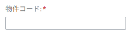

Đặt `mandatory=true` cho `FilterGroupItem` của Input tương ứng.  
Việc xác thực nên được thực hiện trong quá trình tìm kiếm.

```xml
    <!-- e.g. -->
    <fb:FilterGroupItem
        id="FILTER001"
        groupName="group1"
        name="proj"
        label="{i18n>proj}"
        visibleInFilterBar="true"
        mandatory="true"
    >
        <fb:control>
            <Input
                id="INPSPH001"
                value="{screen>/proj}"
                enabled="true"
                maxLength="10"
                submit="onPressSearchButton"
            />
        </fb:control>
    </fb:FilterGroupItem>

```

### Phần hiển thị danh sách (Table)

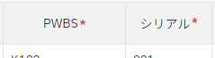

Đặt `required=true` trên `Label` tương ứng với Input mục tiêu.  
Việc xác thực nên được thực hiện trong quá trình đăng ký.

```xml
    <!-- e.g. -->
    <table:Column
        id="COLUMN01"
        width="8.5rem"
        name="{i18n>columnName01}"
        hAlign="Center"
    >
        <Label
            id="LABEL001"
            text="{i18n>columnName01}"
            required="true"
        />
        <table:template>
            <VBox id="VBOX001">
                <Input 
                    id="REQUIRED001" 
                    required="true"
                    value="{oDataTable>requiredValue}" 
                    maxLength="24" 
                    visible="{= ${oDataTable>flag} === 'I' }" 
                    valueState="{oDataTable>valueStateReq}" 
                    valueStateText="{oDataTable>valueStateTextReq}" 
                    change="onChangeRowField" 
                    liveChange="onAutoSelectCheckbox"
                    textAlign="Begin"
                />
            </VBox>
        </table:template>
    </table:Column>

```

## Yêu cầu nhập ít nhất một trường (Tìm kiếm)

**※ Yêu cầu riêng của khách hàng. Không phải là chuẩn Fiori.**  
Khi ít nhất một trường trong nhiều trường ở phần điều kiện tìm kiếm là bắt buộc, thêm hậu tố **màu xanh** (*) vào tên các trường.

### Phần điều kiện tìm kiếm (FilterBar)

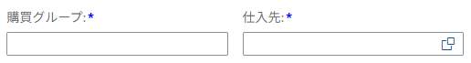

Đặt `mandatory=true` cho `FilterGroupItem` của các Input tương ứng.  
Ghi đè hậu tố **màu đỏ** (*) được định nghĩa trong Style Class chuẩn của SAPUI5 thành **màu xanh** bằng CSS tùy chỉnh (`style.css`).  
Việc xác thực nên được thực hiện trong quá trình tìm kiếm.

```css
    /* Change mandatory(*) color in required fields */
    .sapUiCompFilterBar span.sapMLabelColonAndRequired::after {
        color: blue !important;
    }
```

#### Khi các trường nhập bắt buộc trộn lẫn

Nếu phần điều kiện tìm kiếm bao gồm cả các trường nhập bắt buộc thông thường, chỉ áp dụng Style Class tùy chỉnh cho các trường được chỉ định.

```xml
    <!-- e.g. Required -->
    <fb:FilterGroupItem
        id="FILTER001"
        groupName="group1"
        name="ekgrp"
        label="{i18n>purchase}"
        visibleInFilterBar="true"
        mandatory="true"
    >
        <fb:control>
            <Input
                id="EKGRP001"
                maxLength="10"
                value="{screen>/ekgrp}"
                submit="onPressSearchButton"
            />
        </fb:control>
    </fb:FilterGroupItem>
    <!-- e.g. any of these required / add custom class -->
    <fb:FilterGroupItem
        id="FILTER002"
        groupName="group1"
        name="invoice"
        label="{i18n>invoice}"
        visibleInFilterBar="true"
        mandatory="true"
    >
        <fb:control>
            <Input
                id="INVOICE001"
                value="{screen>/invoice}"
                class="blueMandatory"
                submit="onPressSearchButton"
            />
        </fb:control>
    </fb:FilterGroupItem>
```

```css
    /* Change mandatory(*) color of only the fields that has class 'blueMandatory'. */
    .sapUiAFLayoutItem:has(div.blueMandatory) .sapMLabelColonAndRequired::after {
        color: blue !important;
    }
```

## Tìm kiếm khớp một phần

**※ Yêu cầu riêng của khách hàng. Không phải là chuẩn Fiori.**  
**※ Quy định Input này chỉ áp dụng cho các lĩnh vực Sản xuất (PPPS) và Mua hàng (MM).**  
Đối với các trường nhập văn bản dùng để tìm kiếm khớp một phần (tìm kiếm mờ) trong phần điều kiện tìm kiếm, đặt biểu tượng kính lúp () ở cuối Input.

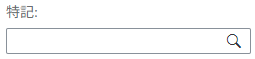

Thêm Style Class `inputIconRight search` vào Input tương ứng,  
và ghi đè Style Class chuẩn của SAPUI5 bằng CSS tùy chỉnh (`style.css`).  
※ Các Style Class được tách riêng để có thể áp dụng các mẫu đặt biểu tượng khác trong tương lai.

```xml
    <!-- e.g. -->
    <Input
        id="READTEXT001"
        value="{screen>/ReadText}"
        enabled="true"
        maxLength="100"
        submit="onPressSearchButton"
        class="inputIconRight search"
    />
```

```css
    .inputIconRight .sapMInputBaseContentWrapper {
        padding-right: 1.25rem;
    }

    .sapUiSizeCompact .inputIconRight .sapMInputBaseContentWrapper:after {
        font-family: 'SAP-icons';
        margin-top: 0.25rem;
        font-size: 1rem;
        margin-right: -0.7rem;
    }

    .inputIconRight.search .sapMInputBaseContentWrapper:after {
        content: '\e00d';
    }
```

## Trường văn bản
**API Reference:** [class sap.m.Input](https://sapui5.hana.ondemand.com/sdk/#api/sap.m.Input)  
**Control Sample:** [sap.m.Input](https://sapui5.hana.ondemand.com/sdk/#/entity/sap.m.Input)

Cài đặt số ký tự và giới hạn nhập liệu (ví dụ: chỉ cho phép chữ và số) theo yêu cầu.

### Chuỗi

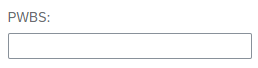

```xml
    <!-- e.g. -->
    <Input
        id="PWBS001"
        value="{screen>/pwbs}"
        enabled="true"
        maxLength="24"
        submit="onPressSearchButton"
    />
```

### Số / Số lượng
Các trường số lượng bị giới hạn chỉ nhập **số nguyên**.  
Các trường số nên được giới hạn nhập theo loại và yêu cầu cụ thể.

| Item type | Nhập được        | Ví dụ                 | Regex                     |
| --------- | ---------------- | -------------------- | ------------------------- |
| Số lượng  | Chỉ số nguyên    | Số lượng tồn kho       | `/^-?\d+$/`               |
| Số lượng  | Chỉ số nguyên    | Số lượng đặt hàng     | `/^-?\d+$/`               |
| Số lượng  | Chỉ số nguyên    | Kích thước lô         | `/^-?\d+$/`               |
| Số        | Chỉ số nguyên    | Chiều dài, Khoảng cách (cm, m, km) | `/^-?\d+$/` |
| Số        | Tối đa 1 chữ số thập phân | Thời gian (h, min, sec) | `/^(-?\d+)(\.\d)?$/` |
| Số        | Tối đa 2 chữ số thập phân | Đơn giá           | `/^(-?\d+)(\.\d{1,2})?$/` |

```xml
    <!-- e.g. -->
    <Input 
        id="NUM001"
        value="{oDataTable>numericValue}"
        liveChange="onliveChange"
        textAlign="End"
        visible="{
            parts: ['oDataTable>flagStatus'], 
            formatter: '.onFormatEditable'
        }" 
    />
```

### Số tiền
Các trường số tiền nên, theo nguyên tắc, hiển thị theo trường tiền tệ tương ứng (ví dụ: `JPY`, `USD`).  
Cân nhắc thay đổi hiển thị động theo loại tiền tệ.  
Sử dụng đối tượng chuẩn JavaScript [Intl](https://developer.mozilla.org/en-US/docs/Web/JavaScript/Reference/Global_Objects/Intl) để thực hiện việc định dạng.

```xml
    <!-- e.g. -->
    <Input id="AMOUNT001" 
        value="{
            parts:['oDataTable>amount', 'oDataTable>currency'],
            type: 'sap.ui.model.type.Currency',
            formatOptions: {showMeasure: false},
            formatter : '.currencyInputFormatter'
        }" 
        maxLength="18" 
        visible="{
            parts: ['oDataTable>Operation'], 
            formatter: '.onFormatEditable'
        }" 
        liveChange="onAmountOfMoneyChange"
    />
```

```javascript
    // e.g.
    // Representation conversion is performed within the created Formatter library.
    /**
     *  Format money on Input value
     * @param {String} sCurrency
     * @returns String currency formatted 123,456,789.00
     */
    currencyInputFormatter: function (sMoney, sCurrency) {
        return Formatter.DisplayMoneyFormatter(sMoney, sCurrency, true, true);
    },
```

### Nhập khoảng

Nhập khoảng cho số lượng, số, v.v.  
Đặt hai Input (TỪ-ĐẾN) trong một Input Group.

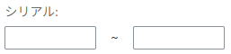

```xml
    <!-- e.g. -->
    <HBox id="HBox001">
        <Input
            id="NUMFROM001"
            type="Text"
            value="{screen>/numericValueFrom}"
            maxLength="3"
            width="100%"
            submit="onPressSearchButton"
        />
        <Text
            id="UNTILTEXT001"
            text="~"
            class="sapUiSmallMarginBeginEnd sapUiTinyMarginTop"/>
        <Input
            id="NUMTO001"
            type="Text"
            value="{screen>/numericValueTo}"
            maxLength="3"
            width="100%"
            submit="onPressSearchButton"
        />
    </HBox>
```

## Ngày

### Chọn đơn
**API Reference:** [class sap.m.DatePicker](https://sapui5.hana.ondemand.com/sdk/#api/sap.m.DatePicker)  
**Control Sample:** [sap.m.DatePicker](https://sapui5.hana.ondemand.com/sdk/#/entity/sap.m.DatePicker)

Trường để chọn một ngày duy nhất từ lịch (DatePicker).  

| Ngày | displayFormat |
| ---- | ------------- |
| Năm-Tháng-Ngày | `yyyy/MM/dd`  |
| Năm-Tháng      | `yyyy/MM`     |
| Năm            | `yyyy`        |

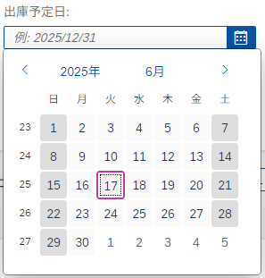

```xml
    <!-- e.g. -->
    <DatePicker
        id="DATE001" 
        displayFormat="yyyy/MM/dd" 
        value="{oDataTable>dateValue}" 
        visible="{
            parts: ['oDataTable>Operation'],
            formatter: '.onFormatVisibleCase01'
        }"
        textAlign="Begin"
        change="onChangeDate"
    />
```

### Chọn khoảng
**API Reference:** [class sap.m.DateRangeSelection](https://sapui5.hana.ondemand.com/sdk/#api/sap.m.DateRangeSelection)  
**Control Sample:** [sap.m.DateRangeSelection](https://sapui5.hana.ondemand.com/sdk/#/entity/sap.m.DateRangeSelection)

Trường để chọn khoảng ngày (TỪ-ĐẾN) từ lịch (DatePicker).  

| Ngày | displayFormat |
| ---- | ------------- |
| Năm-Tháng-Ngày | `yyyy/MM/dd`  |
| Năm-Tháng      | `yyyy/MM`     |
| Năm            | `yyyy`        |


```xml
    <!-- e.g. -->
    <DateRangeSelection
        id="DATERANGE001"
        displayFormat="yyyy/MM/dd"
        value="{screen>/dateValue}"
        dateValue="{screen>/dateValueFrom}"
        secondDateValue="{screen>/dateValueTo}"
    />
```

Tùy theo yêu cầu, việc chọn khoảng cũng có thể được thực hiện bằng DatePicker thay vì DateRangeSelection.

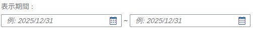

## Nút Radio
**API Reference:** [class sap.m.RadioButtonGroup](https://sapui5.hana.ondemand.com/sdk/#api/sap.m.RadioButtonGroup), [class sap.m.RadioButton](https://sapui5.hana.ondemand.com/sdk/#api/sap.m.RadioButton)  
**Control Sample:** [sap.m.RadioButtonGroup](https://sapui5.hana.ondemand.com/sdk/#/entity/sap.m.RadioButtonGroup), [sap.m.RadioButton](https://sapui5.hana.ondemand.com/sdk/#/entity/sap.m.RadioButton)

Sử dụng cho lựa chọn đơn khi các tùy chọn cố định.

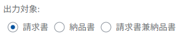

```xml
    <!-- e.g. -->
    <RadioButtonGroup
        id="RADIOBTNGRP001"
        select="onChangeRadioSelected"
    >
        <RadioButton
            id="RADIO001"
            text="{i18n>label001}"
        />
        <RadioButton
            id="RADIO002"
            text="{i18n>label002}"
        />
    </RadioButtonGroup>
```

## CheckBox
**API Reference:** [class sap.m.CheckBox](https://sapui5.hana.ondemand.com/sdk/#api/sap.m.CheckBox)  
**Control Sample:** [sap.m.CheckBox](https://sapui5.hana.ondemand.com/sdk/#/entity/sap.m.CheckBox)

Sử dụng cho cờ (flag) hoặc chọn nhiều tùy chọn cố định.

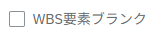

```xml
    <!-- e.g. -->
    <HBox id="HBox002">
        <CheckBox
            id="CHECKBOX001"
            text="{i18n>label001}"
            select="onSelect"
        />
    </Hbox>
```

## Dropdown (Kéo xuống)

### Lựa chọn đơn
**API Reference:** [class sap.m.ComboBox](https://sapui5.hana.ondemand.com/sdk/#api/sap.m.ComboBox) hoặc [class sap.m.Select](https://sapui5.hana.ondemand.com/sdk/#/api/sap.m.Select)  
**Control Sample:** [sap.m.ComboBox](https://sapui5.hana.ondemand.com/sdk/#/entity/sap.m.ComboBox) hoặc [sap.m.Select](https://sapui5.hana.ondemand.com/sdk/#/entity/sap.m.Select)  

Combo box cho lựa chọn đơn.  
Bố cục hai cột (Two Columns Layout) áp dụng tùy theo yêu cầu.  

Khi số lượng tùy chọn vượt quá 30, sử dụng [ComboBox](https://sapui5.hana.ondemand.com/sdk/#api/sap.m.ComboBox) với tính năng gợi ý cho giá trị nhập tay.  
Khi số lượng tùy chọn dưới 30, sử dụng [Select](https://sapui5.hana.ondemand.com/sdk/#/api/sap.m.Select).

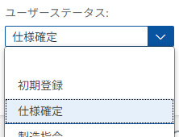

```xml
    <!-- e.g. -->
    <ComboBox
        id="COMBO001"
        change="onChangeComboBox"
        showSecondaryValues="false"
        items="{path : 'dropdown>/items'}"
    >
        <core:ListItem
            key="{dropdown>key}"
            text="{dropdown>value}"
        />
    </ComboBox>
```

### Lựa chọn nhiều
**API Reference:** [class sap.m.MultiComboBox](https://sapui5.hana.ondemand.com/sdk/#api/sap.m.MultiComboBox)  
**Control Sample:** [sap.m.MultiComboBox](https://sapui5.hana.ondemand.com/sdk/#/entity/sap.m.MultiComboBox)

Multi-combo box cho phép lựa chọn nhiều mục.

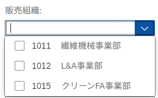  

```xml
    <!-- e.g. -->
    <MultiComboBox
        id="MCOMBO001"
        selectionFinish="handleSelectionFinish"
        items="{ path: 'dropdown>/items' }"
        showSecondaryValues= "true"
        >
        <core:ListItem
            id="_IDGenItem1"
            key="{dropdown>code}"
            text="{dropdown>text}"
            additionalText="{dropdown>code}"
        />
    </MultiComboBox>
```

## Chọn Tệp
**API Reference:** [class sap.ui.unified.FileUploader](https://sapui5.hana.ondemand.com/sdk/#api/sap.ui.unified.FileUploader)  
**Control Sample:** [sap.ui.unified.FileUploader](https://sapui5.hana.ondemand.com/#/entity/sap.ui.unified.FileUploader)

Input chọn tệp. Sử dụng để đọc hoặc tải lên tệp.

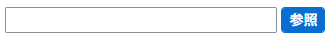  


## Trợ giúp tra cứu (Value Help)
**API Reference:** [class sap.m.SelectDialog](https://sapui5.hana.ondemand.com/#/api/sap.m.SelectDialog), [class sap.ui.comp.valuehelpdialog.ValueHelpDialog](https://sapui5.hana.ondemand.com/sdk/#api/sap.ui.comp.valuehelpdialog.ValueHelpDialog)

Cho phép chọn đơn hoặc nhiều mục từ hộp thoại trợ giúp tra cứu tùy theo mục đích.  
Về các loại hộp thoại trợ giúp tra cứu, tham khảo "[Các loại Value Help](./guide-valuehelp-dialog-design.md)".

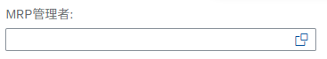
