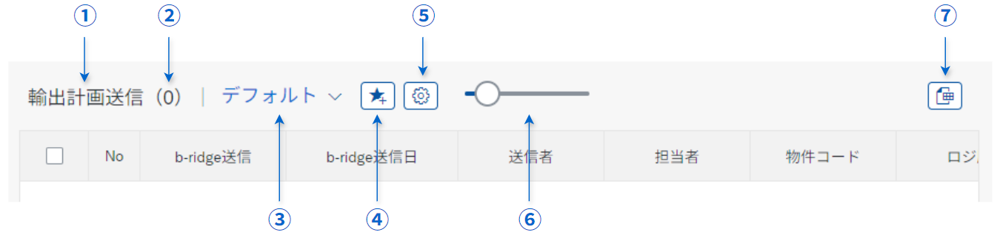

# テーブル 設計

本項で記載する内容は、Fiori FreeStyle アプリケーションにおける [sap.ui.table.Table](https://sapui5.hana.ondemand.com/sdk/#/api/sap.ui.table.Table) の使用を前提としています。  

## 一覧出力部

以下を各領域における一覧出力部の共通仕様として定義する。  
本項に記載される内容が設計書に明記されていない場合は、本資料に記載の内容に基づき開発を行うこと。 

### 文字揃え

テーブルに設置する Text 表記 および 各種入力形式に応じた各種 Input の 文字揃え を下表のとおり定める。  
※ 下表に指定がない Field type の場合は、原則 Alignment = Left とする。

| Field type        | Alignment | sap.ui.core.TextAlign |
| ---------------- | --------- | --------------------- |
| 文字列           | Left      | `Begin`               |
| 単一文字          | Center    | `Center`              |
| フラグ           | Center    | `Center`              |
| 日付             | Left      | `Begin`               |
| 数値             | Right     | `End`                 |
| 数量             | Right     | `End`                 |
| 金額             | Right     | `End`                 |
| 通貨             | Left      | `Begin`               |
| テーブルヘッダ    | Center    | `Center`              |
| CheckBox         | Center    | `Center`              |
| RadioButton      | Center    | `Center`              |

※ Checkbox, RadioButton は、セル内の Group ごとセンタリングする。  
※ CheckBox などに付随する文字列は左寄せ（Alignment=Left）とする。

**Reference:** [sap.ui.core.TextAlign](https://sapui5.hana.ondemand.com/sdk/#/api/sap.ui.core.TextAlign)

### 「No」 列の設置

一覧出力部の 左部に行番号を記載した 「No」 列を設置する。  
No 列の番号は、Fiori アプリケーションにて 抽出したデータソースおよび予め指定されたソート順に基づき、1行目から採番して各レコードに表示する。

### Checkbox の自動化
レコード選択用の Checkbox が設置されたテーブルで Input の値が変更された場合、対象の行をチェック状態に変更する。  
変更を判定するためのイベントハンドラは `liveChange` を採用すること。  
ただし、内部ロジックの都合上望ましい場合に限り、`change` の使用を許可する。  
  
上記と異なる要件がある場合は、画面ごとの要件を優先すること。
以下に記載の事項を共通の表示仕様として定義する。

## ヘッダ部

以下を各領域におけるヘッダ部機能の共通仕様として定義する。  
本項に記載される内容が設計書に明記されていない場合は、本資料に記載の内容に基づき開発を行うこと。 

### 文字揃え

ヘッダ部に表記する列タイトルの文字揃えは 原則  Alignment = Center とする。

### 機能

テーブルヘッダ上部に設置する機能は領域によって異なる。

#### SD, FI

販売領域（SD）および会計領域（FI）では、以下の機能を当領域における共通機能として設置する。  
加えてアドオン画面毎に定義された機能（変更や追加ボタンなど）を設置する。

| No  | 機能               |
| --- | ---------------- |
| ①   | Variant Management         |
| ②   | 表示する行数の選択             |
| ③   | Excel ダウンロード          |
| ④   | ブックマーク（タイルとして保存） |

Variant Management, ブックマーク等の各種機能は `webapp/handler/ControlHandler` 下の各種イベントロジックによって制御する。

#### PPPS, MM

生産領域（PPPS）および購買領域（MM）では機能や表示項目を追加し、同一の機能にはカスタマイズされた UI が採用されている。  
以下の機能を当領域における共通機能として設置する。  
加えてアドオン画面毎に定義された機能（変更や追加ボタンなど）を設置する。

| No  | 機能               |
| --- | ---------------- |
| ①   | 明細タイトル         |
| ②   | 表示件数             |
| ③   | Variant Management          |
| ④   | ブックマーク（タイルとして保存） |
| ⑤   | 列設定              |
| ⑥   | 表示する行数の選択        |
| ⑦   | Excel ダウンロード     |

Variant Management, ブックマーク等の各種機能は `webapp/handler/ControlHandler` 下の各種イベントロジックによって制御する。
