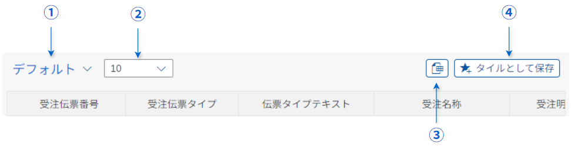
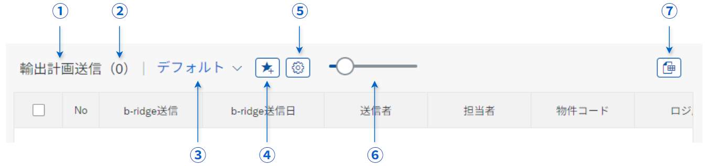

# Thiết kế Bảng

Nội dung được mô tả trong phần này giả định việc sử dụng [sap.ui.table.Table](https://sapui5.hana.ondemand.com/sdk/#/api/sap.ui.table.Table) trong các ứng dụng Fiori FreeStyle.

## Phần Hiển thị Danh sách

Những nội dung sau được định nghĩa là các thông số chung cho phần hiển thị danh sách trong từng lĩnh vực.  
Nếu có mục nào trong phần này không được nêu rõ trong tài liệu thiết kế, việc phát triển sẽ dựa trên nội dung được mô tả trong tài liệu này.

### Căn chỉnh chữ

Căn chỉnh của các phần Text và các loại Input khác nhau trong bảng được xác định theo bảng dưới đây.  
※ Đối với các Field type không được liệt kê trong bảng, căn chỉnh mặc định là Left.

| Field type        | Alignment | sap.ui.core.TextAlign |
| ---------------- | --------- | --------------------- |
| Chuỗi            | Left      | `Begin`               |
| Ký tự đơn        | Center    | `Center`              |
| Cờ               | Center    | `Center`              |
| Ngày              | Left      | `Begin`               |
| Số                | Right     | `End`                 |
| Số lượng          | Right     | `End`                 |
| Số tiền           | Right     | `End`                 |
| Tiền tệ           | Left      | `Begin`               |
| Tiêu đề bảng      | Center    | `Center`              |
| CheckBox         | Center    | `Center`              |
| RadioButton      | Center    | `Center`              |

※ CheckBox và RadioButton nên được căn giữa theo từng nhóm trong ô.  
※ Văn bản đi kèm với CheckBox hoặc các điều khiển tương tự nên căn trái (Alignment = Left).

**Tham khảo:** [sap.ui.core.TextAlign](https://sapui5.hana.ondemand.com/sdk/#/api/sap.ui.core.TextAlign)

### Cột "No"

Một cột "No" hiển thị số thứ tự của các hàng được đặt ở bên trái của phần hiển thị danh sách.  
Các số trong cột No được đánh số từ hàng đầu tiên cho mỗi bản ghi dựa trên nguồn dữ liệu được trích xuất bởi ứng dụng Fiori và thứ tự sắp xếp đã được chỉ định trước.

### Tự động hóa Checkbox

Trong các bảng có checkbox để chọn bản ghi, nếu giá trị của một Input thay đổi, hàng tương ứng sẽ được đánh dấu tự động.  
Trình xử lý sự kiện `liveChange` nên được sử dụng để phát hiện thay đổi.  
Tuy nhiên, việc sử dụng `change` chỉ được phép khi cần thiết do hạn chế logic nội bộ.

Nếu có các yêu cầu khác với trên, các yêu cầu riêng cho từng màn hình sẽ được ưu tiên.  
Các mục dưới đây được định nghĩa là các thông số hiển thị chung.

## Phần Header

Những nội dung sau được định nghĩa là các thông số chung cho các chức năng phần header trong từng lĩnh vực.  
Nếu nội dung trong phần này không được nêu rõ trong tài liệu thiết kế, việc phát triển sẽ dựa trên nội dung được mô tả tại đây.

### Căn chỉnh chữ

Căn chỉnh tiêu đề cột trong phần header nên là Center (Alignment = Center) theo nguyên tắc.

### Chức năng

Các chức năng được đặt ở đầu header bảng khác nhau tùy thuộc vào từng lĩnh vực.

#### SD, FI

Trong các lĩnh vực Bán hàng (SD) và Kế toán (FI), các chức năng sau được thiết lập như các tính năng chung cho từng lĩnh vực.  
Ngoài ra, các chức năng được định nghĩa cho từng màn hình add-on (như nút thay đổi hoặc thêm) cũng được bao gồm.

| No  | Chức năng                          |
| --- | --------------------------------- |
| ①   | Variant Management                |
| ②   | Chọn số lượng hàng hiển thị       |
| ③   | Tải Excel                         |
| ④   | Bookmark (lưu dưới dạng tile)    |

Các chức năng như Variant Management và Bookmark được điều khiển bởi logic sự kiện dưới `webapp/handler/ControlHandler`.

#### PPPS, MM

Trong các lĩnh vực Sản xuất (PPPS) và Mua hàng (MM), các chức năng và mục hiển thị bổ sung được áp dụng, và các UI được tùy chỉnh cho các chức năng giống nhau.  
Các chức năng sau được thiết lập như các tính năng chung cho từng lĩnh vực.  
Ngoài ra, các chức năng được định nghĩa cho từng màn hình add-on (như nút thay đổi hoặc thêm) cũng được bao gồm.

| No  | Chức năng                          |
| --- | --------------------------------- |
| ①   | Tiêu đề chi tiết                   |
| ②   | Số lượng hiển thị                  |
| ③   | Variant Management                |
| ④   | Bookmark (lưu dưới dạng tile)    |
| ⑤   | Cài đặt cột                        |
| ⑥   | Chọn số lượng hàng hiển thị       |
| ⑦   | Tải Excel                         |

Các chức năng như Variant Management và Bookmark được điều khiển bởi logic sự kiện dưới `webapp/handler/ControlHandler`.
