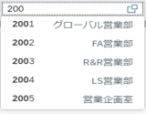
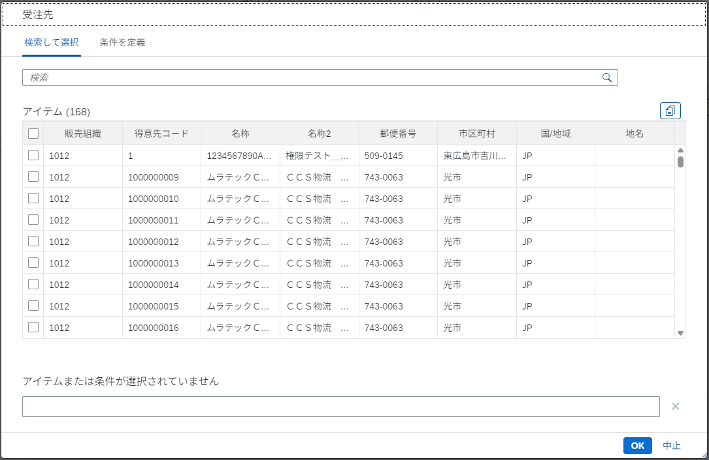
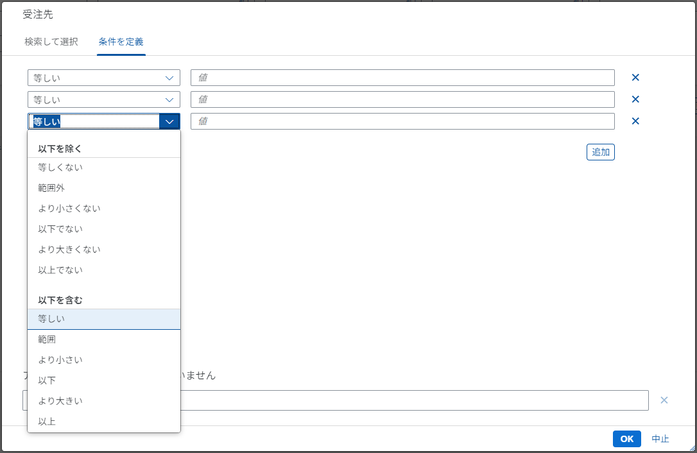
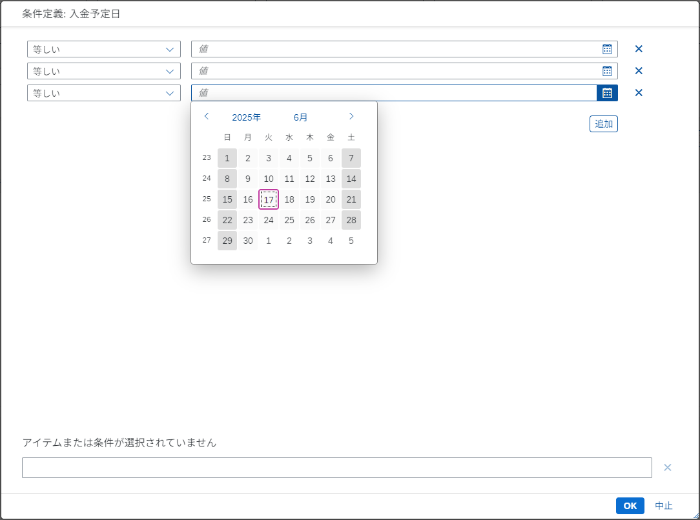
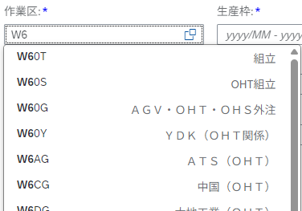
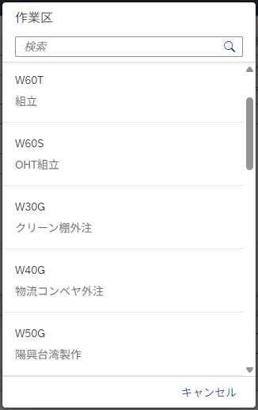
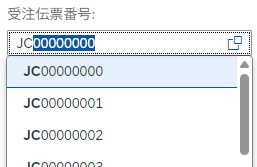
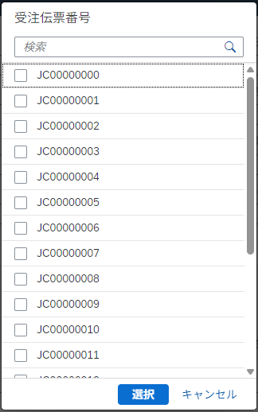

# 検索ヘルプの種類
Fiori FreeStyle アプリケーション で主に使用する検索ヘルプのパターンについて列挙する。  

## 1. 推奨形式

関連情報の参照と複数選択が可能な Value Help Dialog を設定。  
選択肢を関連情報で絞り込みを行いたい場合に使用。  

**Control Sample:** [Value Help Dialog recommended use case](https://sapui5.hana.ondemand.com/#/entity/sap.ui.comp.valuehelpdialog.ValueHelpDialog/sample/sap.ui.comp.sample.valuehelpdialog.recommended)

Input では入力候補から選択が可能。 選択肢をバックエンドから抽出。

ValueHelp 内で一覧検索が可能。 Fragment 内の検索ボックスは一覧のすべての列を検索対象とする（部分一致検索）

細かな条件指定（複数指定を許容）

## 2. 条件入力タブのみの表示

条件指定のみの Value Help Dialog。
複雑な条件指定を複数行いたい場合などで使用。  

**※ 金額項目の場合** ... 条件 INPUT は数値のみ入力を許可すること。  
**※ 日付項目の場合** ... 条件 INPUT には 日付を適切に入力するため [DatePicker](#2-1-単一選択) を設定すること。  

**Control Sample:** [Value Help Dialog with conditions tab only](https://sapui5.hana.ondemand.com/#/entity/sap.ui.comp.valuehelpdialog.ValueHelpDialog/sample/sap.ui.comp.sample.valuehelpdialog.conditionsOnly)

## 3. 単一選択ダイアログ

単一選択のシンプルな Select Dialog。
選択肢の検索が可能なので、大量の選択肢が定義されている場合に使用。  

**Control Sample:** [Select Dialog](https://sapui5.hana.ondemand.com/#/entity/sap.m.SelectDialog/sample/sap.m.sample.SelectDialog) 

Input では入力候補から選択が可能。 選択肢をバックエンドから抽出。

単一選択とValueHelp による検索機能。

## 4. 複数選択ダイアログ

複数選択のシンプルな Select Dialog
選択肢の検索が可能なので、大量の選択肢が定義されている場合に使用。  

**Control Sample:** [MultiInput with Value Help](https://sapui5.hana.ondemand.com/#/entity/sap.m.MultiInput/sample/sap.m.sample.MultiInputValueHelp)

Input では入力候補から選択が可能。 選択肢をバックエンドから抽出。

ValueHelp による検索  
※ Fragment 内で複数選択を可能とする