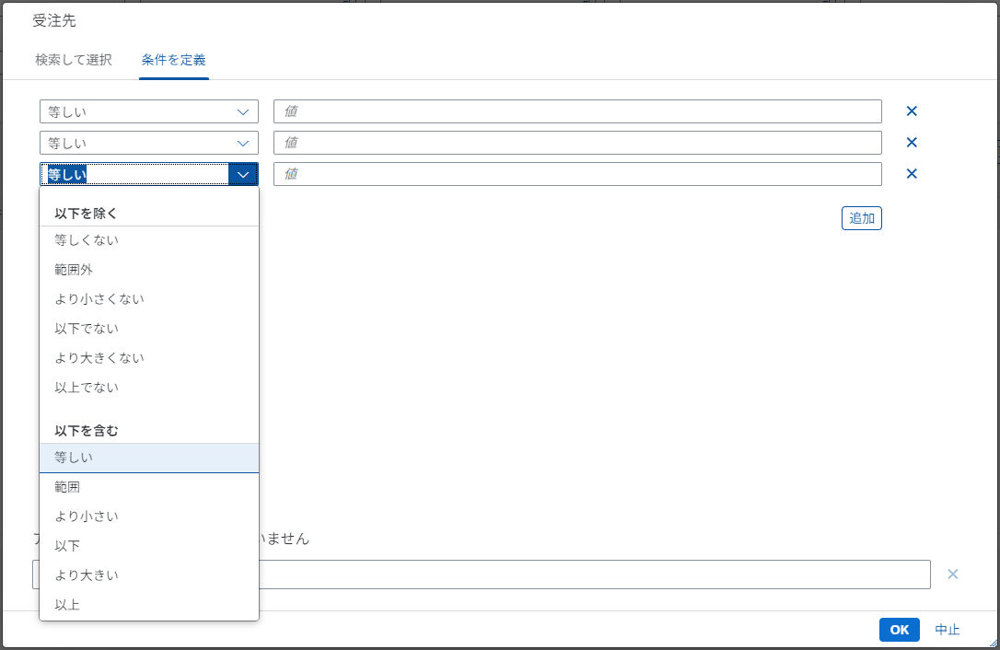

# Types of Value Help
Enumerates the common patterns of value help used in Fiori FreeStyle applications.

## Recommended Format

Set up a Value Help Dialog that allows reference to related information and multiple selection.  
Use this when you want to filter options based on related information.

**Control Sample:** [Value Help Dialog recommended use case](https://sapui5.hana.ondemand.com/#/entity/sap.ui.comp.valuehelpdialog.ValueHelpDialog/sample/sap.ui.comp.sample.valuehelpdialog.recommended)

Input allows selection from suggested entries. Options are retrieved from the backend.

You can search within the ValueHelp list. The search box in the fragment searches across all columns (partial match).

Detailed condition specification (multiple conditions allowed).

## Conditions Tab Only

Value Help Dialog displaying only the conditions tab.  
Used when specifying complex conditions across multiple lines.

**※ For amount fields** ... only numeric input is allowed in the condition input.  
**※ For date fields** ... use [DatePicker](#2-1-単一選択) to allow proper date entry.

**Control Sample:** [Value Help Dialog with conditions tab only](https://sapui5.hana.ondemand.com/#/entity/sap.ui.comp.valuehelpdialog.ValueHelpDialog/sample/sap.ui.comp.sample.valuehelpdialog.conditionsOnly)

## Single-Selection Dialog

A simple Select Dialog for single selection.  
Searchable options, suitable when a large number of options are defined.

**Control Sample:** [Select Dialog](https://sapui5.hana.ondemand.com/#/entity/sap.m.SelectDialog/sample/sap.m.sample.SelectDialog) 

Input allows selection from suggested entries. Options are retrieved from the backend.

Single selection with search capability via Value Help.

## Multi-Selection Dialog

A simple Select Dialog for multiple selection.  
Searchable options, suitable when a large number of options are defined.

**Control Sample:** [MultiInput with Value Help](https://sapui5.hana.ondemand.com/#/entity/sap.m.MultiInput/sample/sap.m.sample.MultiInputValueHelp)

Input allows selection from suggested entries. Options are retrieved from the backend.

Search capability via Value Help.  
※ Allows multiple selection within the fragment.
