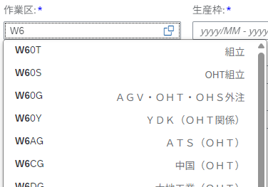

# Các loại Value Help
Liệt kê các mẫu Value Help thường dùng trong các ứng dụng Fiori FreeStyle.

## Định dạng được khuyến nghị

Thiết lập Value Help Dialog cho phép tham chiếu thông tin liên quan và chọn nhiều mục.  
Sử dụng khi muốn lọc các tùy chọn dựa trên thông tin liên quan.

**Control Sample:** [Value Help Dialog recommended use case](https://sapui5.hana.ondemand.com/#/entity/sap.ui.comp.valuehelpdialog.ValueHelpDialog/sample/sap.ui.comp.sample.valuehelpdialog.recommended)

Input cho phép chọn từ các gợi ý. Các tùy chọn được lấy từ backend.

Có thể tìm kiếm trong danh sách ValueHelp. Hộp tìm kiếm trong fragment tìm kiếm tất cả các cột (tìm kiếm gần đúng).

Chỉ định điều kiện chi tiết (cho phép nhiều điều kiện).

## Chỉ tab điều kiện

Value Help Dialog chỉ hiển thị tab điều kiện.  
Sử dụng khi cần chỉ định các điều kiện phức tạp trên nhiều dòng.

**※ Với trường tiền tệ** ... chỉ cho phép nhập số trong ô điều kiện.  
**※ Với trường ngày** ... sử dụng [DatePicker](#2-1-単一選択) để nhập ngày chính xác.

**Control Sample:** [Value Help Dialog with conditions tab only](https://sapui5.hana.ondemand.com/#/entity/sap.ui.comp.valuehelpdialog.ValueHelpDialog/sample/sap.ui.comp.sample.valuehelpdialog.conditionsOnly)

## Hộp thoại chọn đơn

Select Dialog đơn giản cho lựa chọn đơn.  
Có thể tìm kiếm các tùy chọn, phù hợp khi có nhiều tùy chọn được định nghĩa.

**Control Sample:** [Select Dialog](https://sapui5.hana.ondemand.com/#/entity/sap.m.SelectDialog/sample/sap.m.sample.SelectDialog) 

Input cho phép chọn từ các gợi ý. Các tùy chọn được lấy từ backend.

Chọn đơn với khả năng tìm kiếm thông qua Value Help.

## Hộp thoại chọn nhiều

Select Dialog đơn giản cho phép chọn nhiều mục.  
Có thể tìm kiếm các tùy chọn, phù hợp khi có nhiều tùy chọn được định nghĩa.

**Control Sample:** [MultiInput with Value Help](https://sapui5.hana.ondemand.com/#/entity/sap.m.MultiInput/sample/sap.m.sample.MultiInputValueHelp)

Input cho phép chọn từ các gợi ý. Các tùy chọn được lấy từ backend.

Khả năng tìm kiếm thông qua Value Help.  
※ Cho phép chọn nhiều mục trong fragment.
